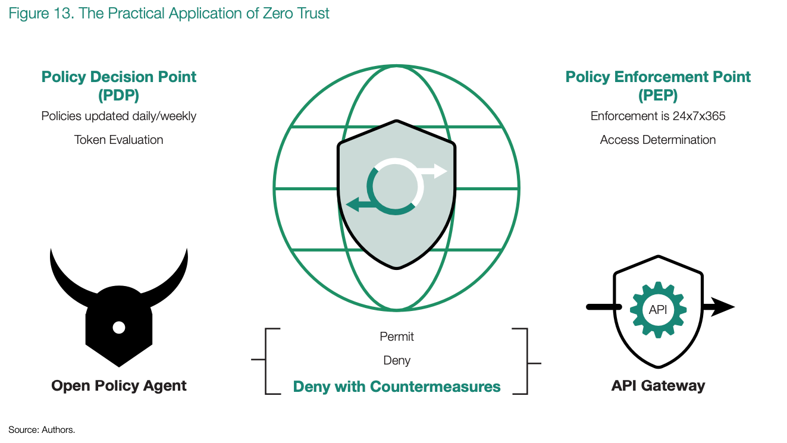

# ACTS 6: Define Zero-Trust Outcomes within Software Applications
Over the last decade, a great shift in cybersecurity strategy took place as organizations recognized that the so-called 
castle-and-moat approach was no longer viable. Today, there is widespread recognition that every network is porous no 
matter how wide or deep the proverbial moat. Even air-gapped networks, seemingly impervious to attack because they are 
not connected to the internet, have proven vulnerable. In 2014, Wired ran a story entitled “An Unprecedented Look at 
Stuxnet, the World’s First Digital Weapon” detailing how an air-gapped network includes hardware and software that 
engineers at some point designed, developed, compiled, and deployed from artifacts that must transit the air gap 
moat.76 The modern view is no one should ever trust hardware, user, network traffic, data, etc. implicitly. 
In what is arguably an unfortunate misnomer, the term zero trust (ZT) captures the modern cybersecurity strategy but is 
more about avoiding implicit trust than advocating for zero trust as an absolute. After all, at some point organizations 
must trust the computer, user, and software enough, or no digital work would be possible.

What has been missing from the ZT conversation is widespread education and conversation about how PEOs have to recognize 
that ZT is a fundamental component of every software activity. From CISA to the DoD, publications cover maturity models 
to reference architectures, all of which are beyond the scope of this report. These documents are valuable, but none of 
them explicitly elucidates the role of the PEO in realizing software that natively exhibits ZT principles. This needs to change.

In its essence, ZT introduces a policy decision point (PDP) that defines operational policies and captures them outside 
of the compiled source code. Chapter 2 established that once developers have compiled, deployed, and disconnected code 
from its build chain, it becomes rigid and resistant to change. PDPs are valuable because the cybersecurity policies 
are detached from the compiled binary and stored as external files that are explicitly intended to be updated weekly, 
daily, or even faster when defined inside of an OODA loop where software defines tactics. Defining policies like this 
inherently creates cyber resiliency when paired with an enforcement engine, a policy enforcement point (PEP) that makes 
an access determination. It is here that the notion of zero trust turns from a linguistic absolute into a practical 
assertion that avoids implicit trust.

ZT and its PDP/PEP combination offer PEOs an unprecedented opportunity to build cyber resiliency in ways that previous 
military platforms (ships, tanks, planes, etc.) have not capitalized on. Instead of operating against a binary decision 
format, permit or deny, ZT introduces a third option known as deny with countermeasures (see figure 13). Forward-looking 
PEOs have started to realize that ZT’s pivot away from a binary and toward a ternary decision format represents a 
cybersecurity revolution in military affairs. Let’s explore this in more depth.

As an example, consider sensitive acquisition data that the DoD manages through a typical web application user 
interface. Historically, either the user had access to the data, or they did not. The website might require a 
government-issued laptop, engagement of a VPN, multi-factor authentication for the user, etc. But the decision was 
always binary: the user either could or could not access the data.

The incorporation of a ZT ternary decision format conceptually creates an unlimited set of outcomes based on 
combinations of metadata: person/non-person entity, device state, data sensitivity levels, network perimeter, 
multi-factor authentication, etc. If a user is on a government-owned laptop that is up to date with all software patches 
and directly attached via wired connection to NIPRNet in a Pentagon office, and logged in via MFA, then the totality of 
the acquisition data set is available within the application. If all things are equal except that the network is now a 
Wi-Fi connection from an internet cafe with VPN enabled, bid/ pricing data is no longer accessible. If the same user is 
on a personal mobile device, only the RFP is accessible—no bid data.

As a final example, consider a second and concurrent login from an OCONUS location that occurs while the user is 
actively logged in from their Pentagon office. Instead of a blanket deny, a deny with countermeasures occurs. The system 
grants the attacker access, or, more accurately, routes them to a honey net that was populated with inaccurate bid data, 
including inaccurate DoDAF models and shuffled bid/pricing data. Instead of giving a deny, deny with countermeasures 
creates a scenario in which cyber defenders actively mine the attacker’s data and their tactics, techniques, and 
procedures (TTPs). Within minutes of the attack’s conclusion, the greatest example of software defining tactics 
occurs: cyber professionals act on what they have learned and immediately update the PDP.

Take this example and extrapolate: project it into the design of software systems for next-generation military 
platforms. ZT represents a cyber revolution in military affairs because it epitomizes how software defines defensive 
cybersecurity tactics, pivots from a binary outcome to one predicated upon combinatorics, and opaquely masks the 
characteristics of both strategy and tactics even when the corresponding doctrine is openly published.

Knowing that engineers designed a system with ZT does not offer an attacker any insight if they breached defenses under 
“permit” or a “deny with countermeasures” conditions. In short, properly integrated ZT throughout a program’s software 
artifacts has the potential to sow fear, uncertainty, and doubt about the data an attacker is accessing.

The DoD needs to thoroughly think through ZT and meticulously include it through the software’s architecture and 
throughout its novel algorithms. It has to consciously design it at every system boundary, at every API endpoint, and 
throughout the user interface itself so that screens do not offer a trace that there is, was, or could be more data than 
what the user has access to at this moment. In fact, these are the types of novel characteristics that a PEO should 
concentrate on because an SLA cannot capture them. The PEO who embraces ZT throughout their novel software implementation 
intrinsically realizes a greater degree of cyber resiliency then merely “shifting security left” into the modern 
software factory.

## Corollary: Realize Digital Transformation without Explicitly Demanding It
Stepping back for a moment, shift the frame of reference away from planes, tanks, ships, vehicles, or whatever platform 
a PEO was established to advance. The realization of ZT is only truly possible when a PEO realizes all of the ACTS 
described in this report. When this happens, the silhouette that begins to form on the horizon is one of digital 
transformation. A simple search will reveal that we have not used this phrase, digital transformation, until this 
point—near the end of this report.

The DoD has been actively discussing its desire to digitally transform, articulating that it needs to do this to 
prepare for a great power competition. But what does it mean to digitally transform? In July 2019, the DoD published a 
Digital Modernization Strategy that defined four strategic initiatives, including one explicitly focused on resilient 
cybersecurity. In describing what this means, it uses many adjectives including seamless, agile, resilient, transparent, 
and secure.77 It established a Digital Modernization Initiative Executive Committee (DMI EXCOM) as a 
governance body for realizing digital modernization across the DoD.

> Through the eyes of a PEO, is digital modernization a perpetual activity analogous to the idea that software is never 
> done? Or is it a set of projects to execute?

All too often, organizations demand digital modernization through ineffective mandates and misaligned metrics. A key 
metric that DoD CIO relies on is the financial expenditure rates that the owning service discloses during the annual 
budget certification. Not only do these rates not reflect progress, they often do not accurately reflect expenditures 
within the PEO’s programs. Organizations have also proposed nonfinancial metrics to measure their digital transformation 
journey, from cloud adoption rates to usage of modern programming languages (not Ada or COBOL). But these metrics 
ultimately have marginal value in a quest to decisively declare that an organization has successfully completed its 
digital transformation.

Perhaps the most compelling way to realize digital transformation is to avoid explicitly demanding it. Digital 
transformation is complex because it is both strategic and tactical, opaque and transparent, a journey and a 
destination. The DoD can reach the destination through the journey of advancing each pillar of the digital triad within 
every PEO, in equilibrium. Transformation materializes where digital logistics meets highly adaptable software-defined 
build chains in a modern software factory, where software defines policy outside the realm of brittle compiled 
executables to create high levels of cyber resiliency, where SLIs cleanly measure delivery of SLAs that offer certainty 
of execution, and where software refines a US kill chain faster than an enemy’s. In practice, the most compelling sign 
of a successful digital transformation of the DoD is that each of the 83 major defense acquisition programs and 
thousands of smaller efforts can showcase how software defines tactics.