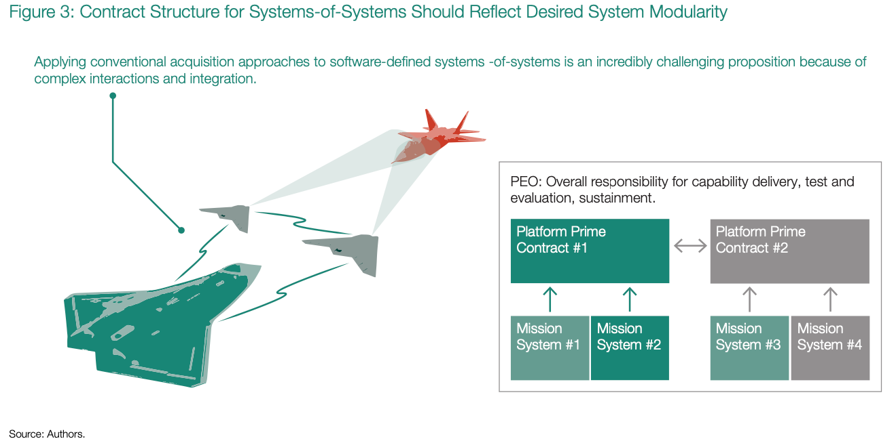
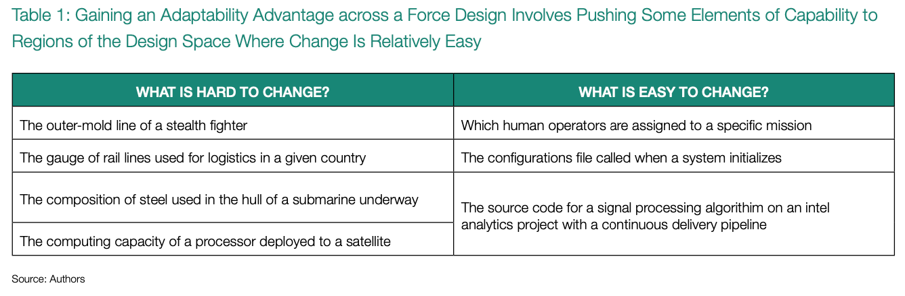

# It's All About Adaptability

>Why software defines tactics for the modern kill chain and how to extract a strategic advantage

The presence of software in current and future military systems is inevitable and undeniable; its existence should be 
_sine dubio_ today. The newer F-35 has a shorter range and lower cruise speed and is reportedly less stealthy than the 
similarly priced F-22 but is still considered the more useful weapon. The reasoning for this relates to the less-
physical “intangible” features in the software of the F-35, including its electronic warfare capabilities, superior 
sensor fusion, ability to communicate more broadly, and ability to detect more threats. Even as early as 1960, the 
F-4 Phantom fighter used software to implement around 8 percent of the performance specifications that the DoD required 
it to achieve.16 By the time the F-22 rolled around, 80 percent of weapons specifications depended on 
software, while emerging unmanned systems, including the Navy MQ-25 and future Air

Force Collaborative Combat Aircraft (CCA) systems, will require software to perform every specified function. And, 
of course, modern militaries depend on more than simply tangible weapons like aircraft and ships to fight. They need 
command and control systems, networking stacks, and edge data processing and presentation. These capabilities exist only 
as software, and more often today they run on commodity commercial hardware because of economics, a theme found 
elsewhere in our paper.

So if software is already ubiquitous in the fielded capability of DoD, why is it necessary to change apparently 
competent acquisition practices? Why do many think that the acquisition corps does not appreciate the value of software 
in the modern kill chain? Any conflict in the foreseeable future will likely leverage mostly the equipment that we 
already own, and military personnel will likely have similar educational and career experiences to those of today’s 
personnel. If the military is largely made up of the three ingredients of personnel, hardware, and software, and we 
already have all three, then why should the military pay any special attention to the procurement, management, and 
delivery of software beyond the status quo?

The best answer to this question could give the United States a fundamental and strategic advantage. Put simply, if the 
DoD acquires and develops software according to the set of principles articulated here, with high-speed delivery 
mechanisms capable of quick changes, then we believe software can enable superior adaptability for the US military 
compared to strategic competitors. Make no mistake—adaptability is not an inherent property of software or of a 
software-defined system. No shortage of software exists in an entirely fixed and unadaptable context. Luddite leaders 
did not dictate nuclear command centers’ use of eight-inch floppy disks through 2019, well after such disks were no 
longer manufactured; an inability to easily adapt the underlying software did so.17 Moreover, foreign 
militaries also have software in weapons, and they too are rapidly realizing that software defines tactics.

The fundamental advantage of software is that it possesses both fluid and solid forms, where these terms relate to 
relatively low and high costs of change. When code is in development and in its source form, it is relatively easy to 
make a tweak here and there to adjust the code’s behavior. However, once the code becomes a compiled binary running on 
an obsolete IBM/1 system, making a change is quite expensive. Hardware, in an analogy to carbon, does not possess a 
practical fluid form. Once it has been deployed, changing its design normally becomes extremely expensive. Similarly, 
once code has been compiled and deployed and disconnected from the build chain that produced it, it generally becomes 
rigid and resistant to change. Change, if any, happens only by returning to code in its source form, and as we will 
explore further, modern source code requires dozens of supporting tools to maintain its malleability.

Achieving a strategic advantage from the hybrid legacy/modern force that the US possesses depends on keeping more 
software in a more fluid form; driving change to counter discovered vulnerabilities; and adapting to emergent 
opportunities that include urgent feature needs, new operational concepts, and especially the deployment of new or 
modified data fields for data science and AI/ML activities. This becomes especially true as future force employment is 
increasingly likely to rely on the cooperative employment of systems-of-systems that any single contractor or a singular 
program office cannot practically deliver. Modern software is no longer some monolithic thing. It exists in no singular 
repository with the advent of distributed version control systems like git. It is no longer built from a singular 
programming language but lives in a diverse and ever-changing environment where infrastructure-as-code and cloud native 
architectures accept, if not encourage, disparate tool chains. Today’s software is rarely designed for a singular type 
of hardware and is often capable of elasticity to expand or contract based on the hardware resources accessible to it. 
Understanding how to achieve software adaptability in the face of the scope and scale of software heterogeneity is 
therefore a central theme of this report.

## The Force of the Future
Military capstone documents and science fiction alike point in the same direction for the force of the future. A new 
Joint Warfighting Concept and its supporting concepts, like Joint All Domain Command and Control, emphasize bringing 
together weapons from different military services that different program offices procure, different contractors build, 
and different personnel from different military specialties operate in different physical domains.18 This is 
not merely some change in organizational chart design or a set of enhanced training exercises. The Joint Warfighting 
Concept, drawing from DARPA’s Mosaic Warfare concept, emphasizes the ability to aggregate and disaggregate the 
underlying combat functions from military units and weapons contributed by all of the services. This vision requires 
the ability to technically integrate and orchestrate the software inside mission systems, operational support systems, 
communications systems, weapons, and even enterprise systems. As this document will show, the heart of this vision lies 
in adaptability for delivering software, in pipelines that allow the specific tactics and operational concepts of 
military capability to shift on demand with the ease of sliding a finger across the capacitive glass screen of a mobile 
phone.

In the science fiction version of future warfare, human operators engineer and corral vast collectives of automated 
systems to achieve a combat advantage. We imagine swarms of systems maneuvering around complex terrain, receiving 
mission updates from satellite constellations, and seamlessly coordinating to realize desired battlefield objectives. 
These visions tend to focus on the ingredients—AI, drones, robotic vehicles, goggles, and touchscreens that allow these 
capabilities to team up with their human counterparts. Robots, in particular, feature in leading roles in this vision. 
But more exciting and more realistic than robotic weapons systems is the prospect of more dynamic military capabilities: 
combinations of forces, operational concepts, schemes of maneuver, and tactics that have themselves become dependent on 
software.

Upon closer examination, a richer version of human-machine teaming that goes beyond a crewed fighter and an uncrewed 
wingman is already upon us. Automated code tests and automated deployment pipelines may seem like trivial robotic agents 
compared to the R2D2 and C3PO that we watch on television but are very real and very mature parts of the software 
delivery enterprise. We are on the verge of discovering that software will define not just weapons systems capabilities, 
but also tactics— how forces are used—and thus military capability writ large.

## Autonomy in the Force

Consider a simple example as depicted in figure 3. On the left, an acquisition program procures a new advanced fighter 
aircraft. The same program office also procures an uncrewed combat aircraft that acts as a wingman, providing 
distributed forward electro-optical and passive radio-frequency sensing in the battlespace, leveraging a smaller 
physical size to reduce its own optical signature, and baiting adversary systems into illuminating it with active 
radars to give away their own location.

The program office elected to acquire these systems from two different prime contractors, with subcontractors providing 
key mission systems. After the contractors delivered each aircraft and its subsystems, the DoD pushed them through a 
rigorous verification and validation process. Each works well, and excellent program management delivered them on time 
and under budget. The DoD also tested the combined manned-unmanned team against surrogate adversary air assets and 
showed it is robustly capable of conducting its distributed air-to-air mission.

Unfortunately, after sudden and unexpected foreign aggression, conflict breaks out. Adversary fighter aircraft reveal 
wartime modes with longer-range missiles that out-stick optical sensors and a new mode in their own radar systems that 
enables them to detect, track, and prosecute the uncrewed wingman without giving away their own positions. Suddenly the 
advanced fighter no longer has an engagement range advantage, and the uncrewed wingmen are more of a liability than an 
asset.

However, all the ingredients for restoring advantage are at hand; the US military simply needs experts and contractors 
to develop the operational concepts, tactics, and digital integration. Operators and technologists suggest three 
independent mitigations to the adversary development. First, developers can update an overhead commercial RF-sensing 
constellation with a new mode to detect adversary fighter emissions; the constellation has the ability to downlink cues 
to the advanced fighter aircraft. Second, nearby naval surface assets have SM-6 missiles that can prosecute adversary 
aircraft if they receive accurate targeting information while the ship itself remains in a passive mode. Third, forces 
can deploy the uncrewed aircraft in a new mode that allows them to act as decoys, baiting adversaries into firing 
missiles that create flares detected via overhead infrared constellations, then using a new jamming mode to defeat the 
targeting endgame of the adversary missile.

Implementing any or all of these three mitigations in a relevant timescale is impossible if the DoD follows a 
conventional acquisition paradigm, even neglecting requirements and authorities considerations. No single program 
executive office oversees all of the relevant elements of the mitigations—all require cooperation among multiple 
military services, multiple existing mission systems, and multiple industry vendors. Working conventional operational 
testing and evaluation across the requisite combinations would be extraordinarily time-consuming, and yet it must 
result in a high degree of certainty in the solution. Indeed, within the conventional acquisition paradigm, despite 
technical feasibility, these mitigations appear to be more of a fantasy than a solution.

This example illustrates that modern combat will be largely concerned with the operational concepts and tactics of 
employing multiple weapons systems in concert. Furthermore, it illustrates the centrality of adaptability, automation, 
and autonomy in driving combat outcomes. While warfighters have always had to shift tactics in response to changing 
conditions in conflict, this theme now extends into the digital realm. Thanks to a proliferation of software-enabled 
mission systems across domains, defining the tactics of a human-machine collective using software becomes possible.

Often, people mistakenly conflate autonomy with automation. They often improperly refer to an aircraft with automated 
guidance, navigation, and control as “autonomous” when it would be more appropriate to say that the aircraft’s automated 
control capability permits it autonomy over its flight path. Fundamentally, autonomy is a relational concept: a case of 
authorities or duties assigned to an agent, whether human or machine. However, as more machines enter the force of the 
future, it becomes necessary to configure them with duties on a time scale consistent with mission planning and 
execution. We cannot freeze the relative roles of a fighter and a wingman solely during the requirements generation 
phase. And because autonomy is about the relationship between elements of the force, acquirers cannot fully define 
roles in the requirements phase except in the most trivial of use cases, like return-to-base behaviors.

With an alternative approach to software acquisition, implementing the imagined mitigations in time to affect an 
adversary’s success would be possible. And the solution does not depend on centralized management, common standards, or 
common development environments. Instead, it depends on the organizations responsible for operating the systems involved 
in the example provided—the Overhead Persistent Infrared (OPIR) program office, the Aegis combat system, the commercial 
satellite services company, and the program office for counter-air systems—maintaining the ability to continuously 
deploy updates and configuration changes to operational capability.

This model preserves the software of each of the relevant mission systems in a fluid state. Developers can push out 
updates to forward aircraft maintainers to load new waveforms, automated flight behaviors, and data processing 
algorithms onto vehicles. They can test these updates robustly using high-fidelity simulation that can also participate 
in multi-system live, virtual, constructive testing to vet the latency-critical aspects of satellites and aircraft 
exchanging data. Program offices can loosely coordinate, allowing engineers to directly cooperate on the details of 
bit-packing a message for transport without any lengthy coordination of a consensus decision-making body. In short, with 
the right approach for software acquisition, the US will have superior combat adaptability and the ability to update and 
define new tactics on the fly.

The essential feature revealed in this section is that advantage in future military contests is less likely to be the 
presence of robotics or AI in military systems and more likely to be effective employment of these (and other) 
components as part of a force design, and specifically the sufficient maintenance of adaptability in the creation and 
implementation of tactics.

## The Military Motivation for Adaptability
Scientists and strategists have long studied the role of adaptability in military contexts. In perhaps the defining book 
studying the topic of adaptation of militaries, Williamson Murray writes:

> In Clausewitzian terms, war is a contest, a complex, interactive duel between two opponents. It is a phenomenon of 
> indeterminate length, which presents the opportunity for the contestants to adapt to their enemy’s strategy, 
> operations, and tactical approach. But because it is interactive, both sides have the potential to adapt to the 
> conflict at every level, from the tactical to the strategic. Thus, the problems posed by the battle space do not 
> remain constant; in fact, more often than not, they change with startling rapidity. Moreover, war in the past two 
> centuries has seen an increasing pace of adaptation, as military organizations confront not only the problems 
> posed by their adaptive opponents [but also a changing technological and economic environment].19

This excerpt introduces the idea that change is an essential feature of conflict. No a priori prediction or perfect 
requirement can accommodate all potential futures. Instead, honing an ability to adapt to an uncertain future delivers a 
military advantage. Theorist Steven Rosen suggests that military innovation in peacetime is concept-driven; it is 
motivated by watching the external environment—what adversaries are doing and what technology is capable of.20 
This contrasts with wartime adaptation, which is driven by direct exposure to adversary engagement. This suggests that 
the present moment is the right one to configure software acquisition and development practices to deliver future 
adaptability.

In his book examining how the war on terror helped China develop concepts to engage the United States in war, David 
Kilcullen likens wartime adaptation to evolutionary processes, with the selection pressure of combat effectively 
rendering extinct outdated tactics resulting in casualties and equipment losses.21 Faced with certain 
surprise in wartime, a contestant must choose between defeat and adaptation and perhaps hope that their ability to 
adapt will enable a surprise of their own.

Drawing on DARPA’s Mosaic Warfare concept, Chris Brose popularized discussion of military kill chains,22 
describing a kill chain as a three-step sequential event in which cognition, decision, and finally action yield an 
objective. This functional decomposition suggests that flexibility and adaptability of the force drive the outcome of 
future conflict more than strength and quantities of force. The military that fields the more adaptable kill chain 
enters the fight with a concrete advantage. In a sobering acknowledgment, Brose shares his belief that the US defines 
its kill chains too rigidly, opening the door for adversaries to devise ways to neutralize our kill chains and, in 
effect, neutralize our technological advantages.

## A Troubled Relationship with Prediction
If adaptability is so important, then it is logical to seek to measure it. Indeed, just writing a requirement that 
software systems be adaptable might even make sense. But here the paradox of adaptability emerges—that one cannot write 
a verifiable test condition for adaptability, and therefore one cannot write a valid requirement for adaptability. A 
test for adaptability would presumably measure the ability to overcome some adverse impact, but a verifiable version of 
this test would require that the specific adverse impact be known in advance. With the foreknowledge of the specific 
adverse impact, the problem shifts to engineering mitigations for this impact, which could be worthwhile but has nothing 
to do with adaptability. Properly speaking, adaptability is about overcoming unforeseen events that we have not 
adequately predicted. Adaptability enables overcoming predictive failure.

Adaptability also enables other subordinate concepts, especially resilience. It can enable the positive effect of 
inflicting surprise by modifying capability. Resilience focuses specifically on the capacity to overcome the negative 
effects of setbacks, damage, and loss to maximize military performance and combat effectiveness. This report examines 
both adaptability and resilience in the context of technology-enabled force design, namely several software-enabled 
mission systems that collectively enable a successful military mission, likely supported by military personnel and host 
platforms.

Napoleon’s statement “To be defeated is pardonable; to be surprised—never!” reveals that good military officers often 
gain great value from planning and attempting prediction, and perhaps that he believed he could somehow escape that 
intrinsic feature of warfare—surprise. The DoD has a particularly strong affinity for prediction, partly arising from 
its bureaucratic mechanics. It assumes the requirements process, in particular, can identify and translate future gaps 
into predictions for weapons systems that perform in a way that satisfies them. The Planning, Programming, Budgeting, 
and Execution (PPBE) process then transforms this requirement into a contract between Congress and the program office 
assigned execution responsibility. This contract notably has predicted the specific phase of development and expenditure 
rate as many as eight years in advance. Then the program manager must defend program execution to an obsolete baseline, 
an obsolete requirement, and an obsolete prediction of the future that she did not generate. That defense acquisition 
works at all under such circumstances is underappreciated. Andrew Krepinevich elucidated the incentives for this 
bureaucratic behavior, suggesting that an employee in the DoD has an incentive not to think about the future because 
doing so “implies things might change and they might have to change along with it, [and to] the extent they ‘tolerate’ 
such thinking, they attempt to ensure that such thinking results in a world that looks very much like the one for which 
they have planned.”23

In short, the problem of being ill-prepared for surprise is not the attempt at prediction but the hubris of believing 
that one’s predictions are correct. This belief interferes with the constructive feedback cycle that drives learning: 
making trials, observing results, correcting predictions, and trying again. Unfortunately, the DoD has developed a 
number of incentives and processes that fall into this dangerous trap, for historical reasons that former Navy 
Secretary Richard Danzig summarized:

> A half century ago, Robert McNamara and his “whiz kids” intensified the predictive tendency, but for different reasons 
> than their predecessors. For McNamara and his colleagues, the challenge was to take an internally competitive, 
> substantially disorganized and significantly dysfunctional DOD and make it more manageable and rational. A key step to 
> this end was to adopt the then-modern concepts of strategic planning with which McNamara had been closely associated at 
> Ford Motor Company. A related initiative was to establish for DOD a single scenario—a Soviet invasion of Western 
> Europe—against which most investments could be measured. This mechanism of resource allocation became a mechanism of 
> program planning in accord with the proposition that “what you measure is what you motivate.” This result was 
> rationalized with the observation that the Soviet scenario was so stressful that all other contingencies would be 
> lesser included cases; they could be readily handled with the equipment, training and doctrine designed for the most 
> demanding Soviet scenario. Of course, this scenario was never as dominant in practice as it was in theory.24

This history also highlights the offensive power of adaptability. In the case of the Cold War, at least part of the 
military advantage came from pressing strategically chosen investments (e.g., stealth strike capability) that the Soviet 
system reacted to in a predictable, non-adaptive way (building out expensive and decreasingly effective air defense 
systems). The key is that effective use of adaptability binds an adversary to their predictions and pre-established plan.

Fortunately for the United States, the Cold War featured an adversary that was almost uniquely bureaucratic, ponderous, 
and predictable, which enabled a relative advantage. This is by no means an endorsement of the predictive power of the 
DoD, which failed to anticipate the breakup of the Soviet Union or the rapid rise of China as a threat.

## Implementing and Measuring Adaptability
While changing the nature of a bureaucracy is hard, enabling better adaptability in systems during their development and 
acquisition is eminently feasible. As this report will go on to show, a core enabler will implement modern DevSecOps 
practices. The fundamental principle behind this measure, however, is keeping some aspects of a system relatively easy 
to change. Indeed, the concept of an “architecture” can be thought of as the relationship between things that are easy 
to change and those that are hard to change.25 As development of any system progresses, developers and 
engineers make choices that freeze aspects of the design.
Table 1 illustrates some aspects of military systems that are relatively easier or harder to change. While any software 
project becomes harder to change over time, it is now possible to maintain more aspects in a fluid state. Choosing these 
aspects and allowing for their continual modification will be the essence of an adaptability advantage.

As joint warfighting and multi-element kill chains, possibly enabled by uncrewed systems and artificial intelligence, 
become part of the future of warfare, it implies an architectural shift from relatively monolithic software 
implementations that were tightly coupled to extract performance in SWAP-constrained systems toward less stateful and 
more service-oriented or API-enabled approaches that enable recomposition of the underlying mission system capabilities 
in weapons. As military capability becomes disaggregated (a satellite sensor passes data to a fusion engine hosted 
onboard a command-and-control aircraft, which passes a target coordinate to a fire control computer on a mobile missile 
launcher), the computing aspects are also likely to become distributed. This further implies that not all of the 
elements are under the control or authority of one program executive officer, or will be designed to the same “global” 
standards. Pragmatically, this creates a mandate to adjust the software architecture and development environments to 
allow for more decoupled development between distinct, heterogenous systems.

Fielding capability is not just about development, of course. It needs to accommodate a whole range of -ilities. Here 
again, we find technological developments that begin to make this practical. Automated tests that are part of a 
continuous delivery pipeline can approximate many of these. Development must also include the creation of environments 
that allow for these automated tests. We can consider them as miniature “fitness functions” that help shape the 
evolution of a body of code by providing feedback on the impact of changes. These will span in scope from code unit 
tests all the way up to live, virtual, and constructive (LVC) environments that allow testing the performance of 
multiple mission systems from different program offices together.

Adaptability is in the class of -ilities that we cannot directly measure, and cannot require, but can characterize with 
the help of fitness functions. DARPA has previously explored schemes for measuring adaptability of systems. One 
promising approach that emerged was to use the time required to respond to a previously unanticipated requirement—the 
time to react to surprise. The Air Force’s Kessel Run project demonstrated the ability to deploy aircraft operations 
planning tools overnight to accommodate a previously unanticipated need during the Afghanistan evacuation, essentially 
overcoming predictive failure. Netflix’s approach to engineering resilience in its systems by using a “chaos monkey” to 
inject surprise via severing processes and links is a related fitness function that holds engineers accountable for 
architecting a resilient system. It’s not surprising that time (or time to respond) emerges as the metric for 
adaptability. This aligns with the finding of the Defense Innovation Board that speed and cycle time are the most 
important metrics for managing software.

Change is a certain feature for the future, stemming from commercial innovations, adversary developments, and brilliant 
new ideas. No data schema, interface standard, programming language, or tool set will remain timeless in the face of 
these changes, but some will change faster than others. The United States can extract military advantage by 
understanding how to ensure adaptability in software-enabled systems.

There is a longstanding and fundamentally flawed notion that the DoD should standardize acquisition processes and 
technologies across all of its activities. One of the principal conclusions of the Defense Science Board (DSB) in its 
1987 review of software development and acquisition for the DoD perhaps best represents this idea:

> It is very important for DoD to have a standard programming language; Ada is by far the strongest candidate in sight.26

This quote is the epitome of flawed thinking about homogeneity. The document went on to lament the period when the DoD 
could effectively set standards for the commercial software development ecosystem, noting Navy Rear Admiral Grace 
Hopper’s role in creating the COBOL language that was widely adopted in commercial practice. The DSB sought to reassert 
a military role in defining standards that could shape developments in the commercial sector.

With the benefit of 35 years of hindsight, most readers will intuitively recognize the folly of trying to constrain all 
of computer programming to a single language controlled by the DoD. Moreover, if the DoD attempt at asserting 
centralized control over development had succeeded, the world might have never known many of the innovations in 
programming languages that have occurred in the three decades since—from C’s approximation of a portable assembly 
language with high efficiency to the high-level languages (like Python) that speed development and massive libraries 
(like react.js) that power rapid development of the modern web.

Of course, modern software development combines multiple languages in single projects; for example, one web application 
might use JavaScript for front-end development, Python for data processing, and PHP for server-side scripting. The 
debate about a single standard turns out to be frivolous, and the DoD would do much better by spending time 
understanding which tools fit which jobs. This extends well beyond programming languages and into the massive 
decomposition of software tooling that has occurred over the years. In the 1990s, the client-server architectural style 
saw singular tools capture programming teams. Tools like FoxPro, PowerBuilder, and Delphi were homogenous programming 
environments—front end, business rules, database queries, compiling, testing, source control—in which everything was 
built into the tool, and the idea of third-party tool chains was nascent at best.

Today, every part of the development process relies on different tooling. One supply chain source provides the source 
code repository tooling, while other sources provide the integrated development environment (IDE), infrastructure 
automation, cloud tooling, user experience (UX) design features, and user interface (UI) testing. Where the 
architectural quanta used to be an ordinal value of it, today’s modern and adaptable development environments pull 
together dozens of tools. Modern software development activities are more logistically focused than at any time in 
the past. Today’s software development environments are so heterogenous and adaptable that they are more akin to 
digital logistics.