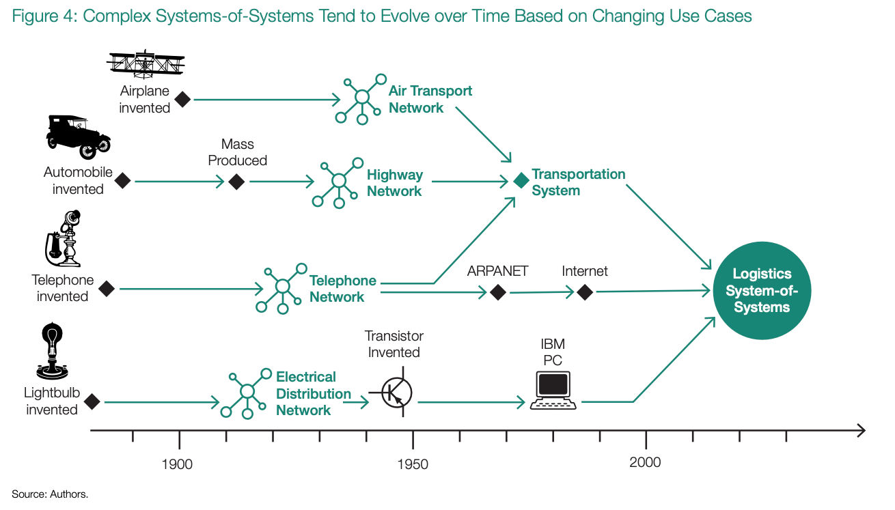
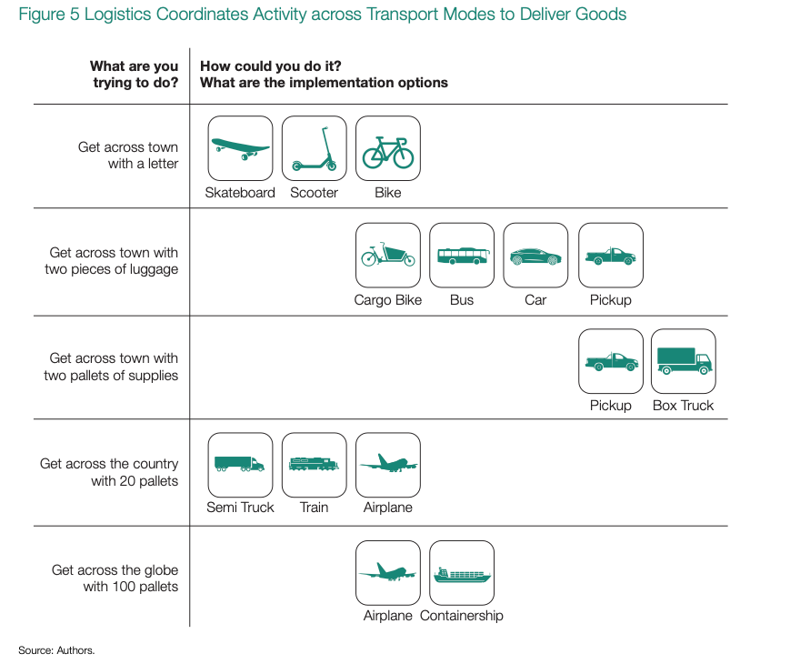
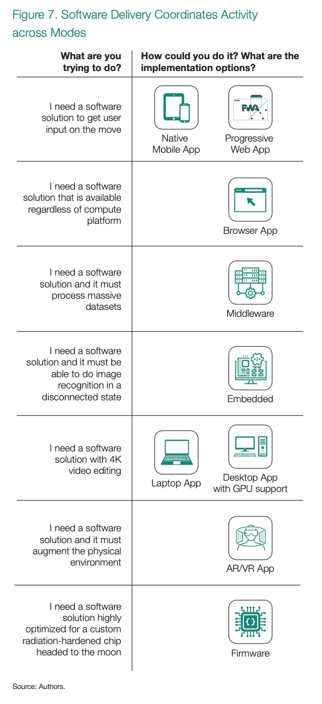
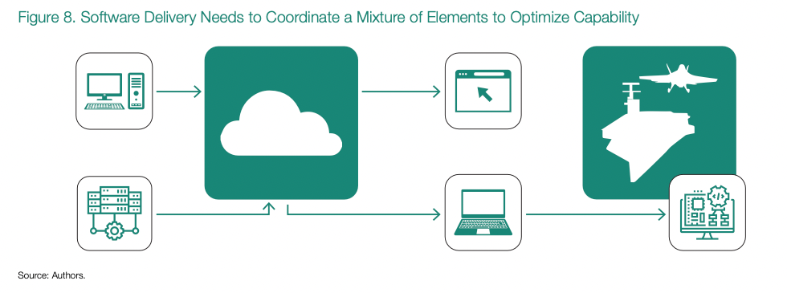
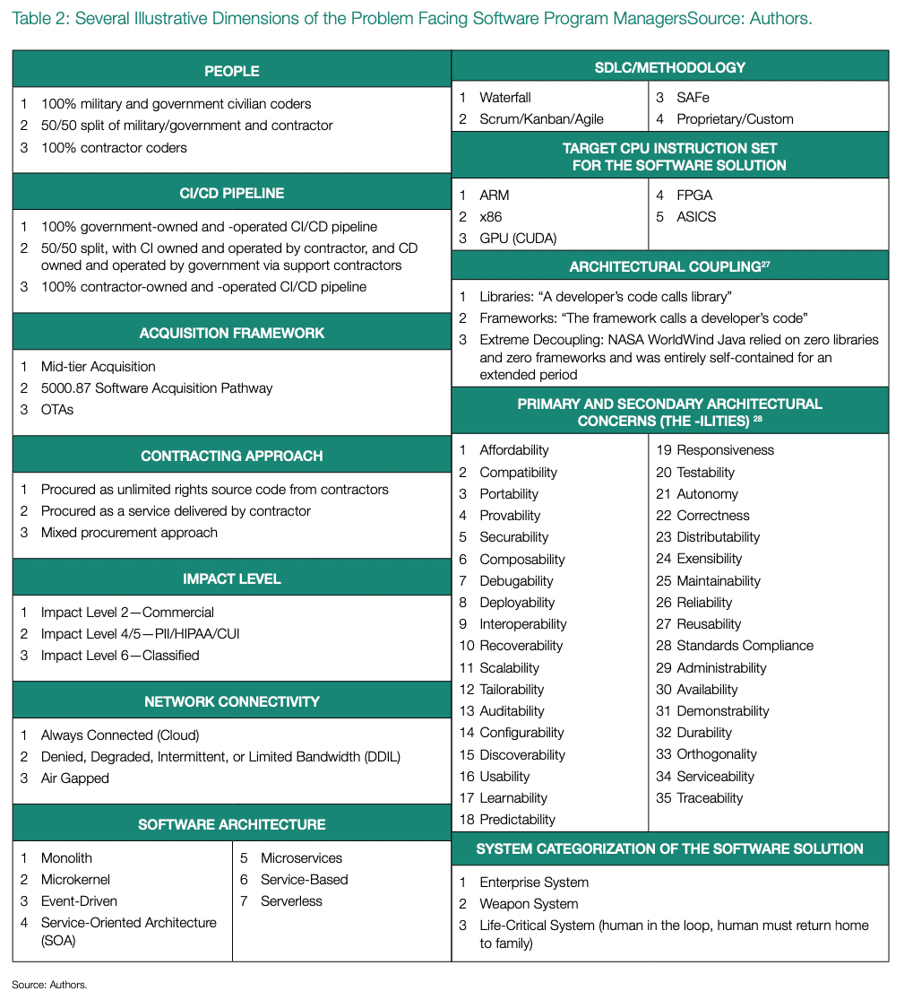
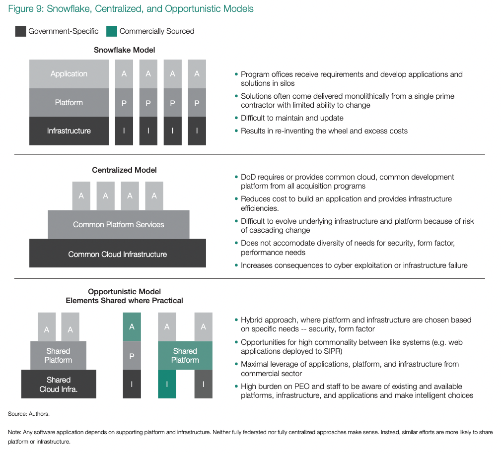

# Like Digital Logistics
> Software delivery is about getting the right bits to the right places at the right time

An old principle of warfare suggests that outcomes are less about the forces you have than about your ability to keep 
them in motion and employ them effectively. The pithy quote “Infantry wins battles, logistics wins wars,” attributed to 
Army General John J. Pershing, commander of the American Expeditionary Forces on the Western Front during World War I, 
summarizes this concept.

But what of modern military capability? It still needs infantry, but it also needs to pull data from a satellite imaging 
system, connect a radar track to a missile battery, and deliver a moving map with adversary locations to an 
infantryman’s tablet.

As the previous chapters have shown, software is not only transforming the economy but becoming deeply intertwined with 
military capability. Much like logistics is about moving materiel to deliver capability to the time and place of 
greatest need and impact, software delivery is about delivering software artifacts to the time and place (host 
environment) of greatest need and impact. And much like in logistics, the mastery of software delivery can be a 
war-winning (or -losing) capability. Also similar to logistics, the DoD needs to lay the groundwork for software 
delivery in peacetime to enable the strategic advantages of superior adaptability described in the previous chapter.

## Reflecting on Logistics
The logistics system has evolved over centuries as depicted in figure 4. Inventions gave rise to networks, which led to 
systems and then systems-of-systems. As system designers coupled more elements, complexity increased, and design spaces 
became more open.

Notably, the logistics system is much more than a collection of ships, trucks, and airplanes. It couples together the 
highway network, rail network, air transport network, and more—a rich network-of-networks for different transportation 
modalities. Further, it is a complex system-of-systems run by software connecting many systems and networks to maximize 
flexibility. For example, the military combines its dedicated transportation capabilities with long-term commercial 
contracts and on-demand indigenous support from host countries.

Layers of information systems stitch together this enterprise: A military software system automatically issues orders, 
and a commercial transportation management system receives them. Third parties collect worldwide location information, 
fuse it to make delivery time predictions, and sell it back to enable superior inventory management. Notably, diversity 
and complexity are an essential feature of the logistics system.

Breaking this down to a simpler use case as shown in figure 5, readers can see intuitively that embracing this inherent 
diversity of transportation modes and coordinating across them is a feature. Key performance parameters like distance 
and payload help drive choice, but so do availability and personnel familiarity.

There are hidden dimensions to the logistics problem as well, as depicted in figure 6. An organization may acquire any 
given transportation element in many different ways—choosing to buy a service, or operate the vehicle itself, choosing 
to buy a vehicle off-the-shelf, custom-build, or rent. It would be irrational to imagine designing a logistics system 
of any reasonable scale that is homogenous in nature—using only one transportation mode. Instead, the ideal is the right 
modes for the right parts of the problem.

## Similarity to Software Systems
As illustrated in figure 7, software delivery has more than a passing similarity to delivery of goods. Many forms of 
application and target architecture are available. Just as it would be irrational to have the military pick one mode of transportation, it is irrational to ask the military to standardize one solution architecture from the set (mobile 
phone, tablet, laptop, desktop, browser, augmented or virtual reality device, middleware, embedded, firmware). Instead, 
effective mastery of software systems involves coordination across multiple modalities.

For example, not all military software will be delivered and consumed as cloud-hosted web applications. In figure 8, a 
programmer might use a desktop environment to commit changes to a cloud environment, which also draws in libraries and 
middleware from other communities. The same cloud environment might host a web application that provides real-time 
status updates for a deployed squadron. Someone forward-deployed on the squadron might use a laptop computer to pull 
a feature release from the cloud when connectivity is available, then configure an embedded system on an aircraft prior 
to its mission without connectivity.

The choices of transportation modes are not only about distance and payload; they can be about changing circumstances 
as well. Generically, we can describe these changes of circumstance or need as gradients. A Silicon Valley resident 
might rent a scooter to get to the bus stop, take the bus to the train station, take the train into San Francisco, then 
order an Uber because it is now raining and the destination is uphill. Changes in environment drive each decision to 
transition.

As the military recognizes that it operates using systems-of-systems, which implies a large number of gradients, it 
also needs to accommodate that. A future aviator might use a mobile phone app to schedule simulator time, then use 
AR/VR to practice the mission in a constructive training environment, and afterward debrief with the training team, 
replaying the training using dual 4K displays connected to a desktop computer in the conference room, before ultimately 
executing the real-world mission using a combination of firmware and embedded software. Then, upon their safe return to 
base, they might offload all of the sensor data into headless middleware running in the cloud for post-mission analysis 
and intelligence exploitation. Not only should the DoD tolerate this diversity in environments, it should recognize it 
as beneficial.

## Software Solutions as Combinatorics Problems
Now consider the development of a complete software solution architecture in this ecosystem as a combinatorics problem 
that every PEO faces. The following is notional and illustrative, incomplete and certainly not normative, but the point 
is clear to the reader in table 2:

Just performing the combinatoric math on this vast array of choices and considerations suggests that there are more 
than 6 billion combinations for a PEO to navigate. This is without considering effects of characteristics of data, AI/ML 
models, and other supporting technologies. In the face of this complexity, it simply is not realistic to assume there is 
one best software delivery solution for the DoD. Instead, acquisition personnel need to embrace heterogeneity to 
successfully navigate the complexity.

## Navigating the Complexity
Navigating this complexity is possible, but the conversation should be framed around economics, not technology or 
innovation. At the end of 2021, GSMA reported that 5.3 billion people subscribed to mobile services, representing 67 
percent of the global population. When accounting for machine-to-machine mobile subscriptions as well, there will be 
more than 8.5 billion mobile connections globally by 2023.29 This astounding statistic means there are more 
cellular system on a chip (SoC) microprocessors connected to the internet than there are people living on the planet 
today. In 2021, the industry manufactured over 1 trillion chips, according to ASML,30 representing 130 chips 
for every person on earth, and the cost to build a fab topped $14.6 billion.31 Organizations can realize the 
massive investments required to advance the state of digital technologies only because of the scale of the consumer 
market; no DoD acquisition program can possibly compete with this scale or pace.

Consumers realize the true value of all of these chips only through the software applications running on them. By 2025, 
these chips and the software will produce 175 zettabytes of data per year.32

These statistics portray the economic landscape that the DoD and its collection of PEOs find themselves operating in 
today. The DoD was once the proverbial 800-pound gorilla; landing a DoD contract justified ramping up production. This 
just is not the case anymore. Today, the economic landscape has changed so dramatically that the global chip foundries 
and massive global software organizations like the Cloud Native Computing Foundation (CNCF) could more accurately 
describe the DoD’s consumption as a rounding error. The most suitable word for the effect of this economic landscape 
is forage; the DoD has to forage for access to chips and software solutions these days because landing the DoD as a 
customer is not nearly as economically exciting as targeting an enormous consumer market.

The Government Accountability Office stated in a 2022 report that the DoD plans to acquire 2,500 F-35 
aircraft.33 The precise number of chips in the F-35 design is not publicly available. However, even in a 
ridiculously concocted hypothetical scenario in which the DoD seeks to purchase 10,000 chips per aircraft, that’s only 
25 million chips, or roughly 0.000025 percent of the trillion chips manufactured in 2020. The model year 2020 Mercedes 
S-Class is reported to include over 30 million software lines of code.34 In contrast, the F-35 is reported 
to have only 8 million software lines of code.35

Viewed through an economic lens, the consumption of chips and software by the most technologically advanced platforms 
under development by the DoD pale in comparison to the total addressable market in the commercial space.

Only a few decades back, this was not the case—DoD products were at the forefront of new-scale fabrication processes 
and facilities. We cannot lament this change or attribute it to DoD dysfunction; instead we need to recognize the 
virtuous economic cycles spun up by information technologies that create a massive commercial market. And we should 
also accept the changes it implies. Economically speaking, the DoD has to forage for dual-use technologies, and this 
is where both the greatest opportunity and the gravest risk to PEO forecasting exist.

## Finding Economies of Scale
Traditionally, the DoD approach to software delivery was to distribute funding and requirements to a program office, 
which issued contracts with discrete deliverables that could meet said requirements.

The downside of this approach is that it treats weapon systems as independent, as snowflakes derived from requirements. 
Only the rare program manager would seek out commonality and opportunities to reuse other building blocks. This is the 
model that yields a littoral combat system with a control console that comes fully bundled—screens, CPU, throttles, 
operating system, and software with user interface to ship machinery that is integrated and tested by the prime 
contractor. As time progresses, though, the fleet and the program office must struggle to patch the operating system, 
replace a failed memory chip, or interface with an updated valve servo controller that uses a different message 
protocol. Each of these requires contract modifications to the original prime and an updated snowflake that fixes the 
problem.

An attractive alternative seeks an analogy between a commercial company and the DoD, depicted as the centralized 
model in figure 9. No modern nimble start-up would dream of development in the snowflake model. Instead, the founders 
would choose a cloud provider and build out a development platform, and as employees come onboard and products 
diversify, the company would build a whole set of applications on top of this cloud infrastructure and platform 
services. This has the advantage of low incremental costs for every new application—there is no need to reinvent the 
wheel and build out a new platform for each new application. Presumably, the DoD would contract for centralized 
secure cloud services, build out its own joint common foundation for platform services, and either centrally fund or 
mandate use of these services. This could enable rapid collaboration and data consolidation and is especially 
conducive to centralized applications, like many commercial ML approaches.

Unfortunately, the centralized model is unworkable. The needs of the DoD are simply too diverse. There are legitimate 
needs to operate at a variety of security levels, and it is impractical to simply elevate the security privileges of 
all users and applications. Some DoD software needs will be humble, like embedded software for servo controllers to 
point antenna arrays, which will need to operate in an air-gapped environment yet still be capable of future updates 
to handle patching. This cannot be forced through a monolithic development pipeline for web applications. Additionally, 
the centralized model fails to fully leverage the benefits of commercial development. In some instances, commercial 
applications will be well suited for use in a disconnected secure network. In other cases, a commercial data extract-transform-load or AI model-building tool will be perfectly suited to serve a secure application. In other 
cases, the DoD could be developing its own applications on a quasi-public cloud for use by allies and partners. Put 
another way, the DoD is more like an economy than a company.36

Thus, this report proposes a third model—an opportunistic model—in which, like the snowflake model, the burden of 
choosing a path still falls to the PEO with the requirement. But in this third model, the PEO asserts their role as the 
final integrator of the delivered capability, and shoulders the responsibility for seeking out available and similar 
infrastructure and platforms from partners. This is the most workable model, providing both the developmental efficiency 
and fiscal responsibility that taxpayers demand. For most large acquisition efforts, this will likely involve 
establishing a software factory or finding a suitable existing one. The DoD will almost certainly make mistakes, as 
when the Air Force’s Kessel Run initially chose Pivotal Software, which Dell has since acquired, to provide its 
platform37 before eventually realizing that this compromised the government’s needs to continue to integrate, 
maintain, and deliver the overall capability. While it lost some time due to the mistake, this was part of the learning 
process, and ultimately Kessel Run emerged in a stronger position. Silicon Valley start-ups often make similar foibles; 
for example, Snap reversed its decision to go all-in on Amazon Web Services and recognized its need to diversify its 
infrastructure providers.38 The external environment and available infrastructure and platforms will continue 
to shift through the course of any development effort.

## Evolutionary Architectures
A common fallacy is seeking to fully define a software architecture before starting software development. This draws 
from flawed but conventional wisdom on the importance of getting the requirement right before starting a hardware 
acquisition. Of course, it is possible to make colossal architectural errors at the outset of an effort, but these 
errors have severe consequences only if architects doggedly adhere to flawed choices in the face of evidence. 
Experienced software architects will readily admit that the best architectures are evolutionary, rarely rigid over the 
life of a software application.

It is easy to get caught in prediction traps and to ignore the fact that future-proofing in software development makes 
it more difficult for developers to use the code for any single purpose. Future-proofing can make it harder to deliver 
an initial working product and collect feedback. In many cases, it is better to start solving an important problem and 
to accept a marginal amount of technical debt. Those same software architects from above will also say that premature 
optimization is evil.

Architectural patterns show up in logistics too, of course. The major commercial logistics company FedEx does have to 
plan its investment in air transport capacity, contracted surge capacity, ground transport capacity, sortation capacity, 
and so forth. But it does not try to predict the right path for each package years ahead of time. FedEx has made some 
choices that are frozen— hub airports, air fleets, major sortation facilities—but has kept open the ability to flow any 
individual package over many paths depending on the superior knowledge of the present moment. It handles uncertainty by 
flying empty aircraft from its hub that can divert to satellite airports in case of mechanical failure or excess demand. 
While leaders made some choices early in the history of the company—including selecting Memphis as a hub and enabling 
overnight delivery—much of the physical architecture of FedEx emerged in the decades that followed as the company 
evolved and discovered new markets in international delivery, home delivery, and palletized load delivery. Even as a 
company heavily invested in capital infrastructure, FedEx did not start by defining its architecture; it focused on 
solving customer problems.39

Instead of defining and reviewing software architectures in a waterfall fashion, a PEO can better spend their time 
deciding which of their desired outcomes and user needs is most important, which future development paths are most 
uncertain, and which aspects of their program will most likely need to change. Time spent on these questions, coupled 
with initial development, is how architectures will emerge.

The focus on where the initial development occurs is a complicated matter. Abe Karem, the ex-Israeli aircraft designer 
who created the Predator unmanned aerial vehicle (UAV), famously stated that “the defining characteristic of a good 
engineer is their laziness; mediocre engineers try to do all of the work themselves.” By extension, the defining 
characteristic of a good PEO is a desire to extend what exists instead of doing all of the work themselves. This 
amplifies the sentiments of senior leaders such as Renata Spinks, cyber technology officer to the US Marine Corps 
Forces Cyberspace Command:

> The Marines do not want to do anything all by themselves. We are a team-of-teams institution. Every platform is 
> different, and none of them are one-sizefits-all. If there’s a capability or a gap, the first thing we do is go see 
> who else has this and what does “right” look like.40

Over the last few years, the number of cleverly named software factories across the DoD has rapidly grown to at least 30 
today.41 Others across the Air Force, then across each of the other services, and finally across the DoD’s 
fourth estate quickly followed the trail that Kessel Run blazed. How does a PEO explore, quantify, and then rationalize 
the logistics required for a software factory that can complete the initial software development tasks?

Over a decade ago, John D. Cook postulated that software reuse is better described as performing an organ transplant 
than snapping together Lego blocks.42 By extension of his analogy, the modern software factory likely has 
more in common with a Level 1 trauma center than a Legoland Discovery Center. As software continues to permeate the 
fabric of every program, each PEO has to confront complicated software factory logistics and choose a path: build or 
reuse.