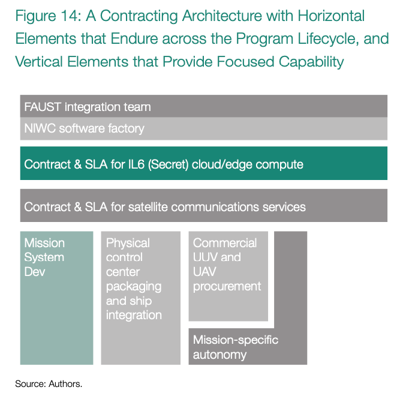

# Exercising ACTS: A Vignette

> Under pressure to deliver

_This is a fictional exercise with fictional contractors. Any representational link to actual entities is purely coincidental and unintended._

**Situation**: It’s a Tuesday in July. You are the Navy program executive officer (PEO) for unmanned systems and are 
getting an update brief on an emerging Navy requirement for a new anti-submarine warfare system provisionally referred 
to as the Future Autonomous Underwater Submarine Tracker (FAUST) system. Extensive studies by the Office of Naval 
Research, N81, and DARPA have suggested that architectures like this are the only affordable, near-term option to track 
a large number of diesel submarines over a wide area. Budgetary constraints have forced the Navy to dive into an 
unconventional and high-risk acquisition—a Faustian bargain, if you will.

Key components of the FAUST reference design include:

* A containerized information processing system that can be ߪ hosted on multiple Navy vessels, including the littoral combat system, that supports tactical employment and possible target engagement

* Small unmanned underwater vehicles with an acoustic pay ߪ load and a ship-based launch system

* Ship-launched unmanned aircraft capable of deploying ߪ small buoys with acoustic payloads

* Specialized algorithms for estimating submarine types and ߪ locations, coupled to acoustic payloads

* Terminals and connections to commercial satellite telecom ߪ munications providers, over which the system establishes a secure link for remote low-bandwidth data exchange
* A support information system that can track logistics status ߪ and requests for the system and provide tactical tracking data to other military users via a secure web application deployed to SIPRNet

The requirements are frustratingly fuzzy, and it seems your challenge will be as much expectation management as program 
management. Navy seniors seem to expect an operational capability to be delivered tomorrow despite an unproven 
architecture and brand-new acquisition approach. Your team has been tracking this requirement as the staffing process 
develops and refines it. Staff have begun performing market research in support of planning an acquisition strategy. 
They are also evaluating technical approaches that differ from the reference design. The Navy’s experience with similar 
modular system architectures—including counter-mine modules for the littoral combat system—inform thinking about the 
risks and challenges of a distributed system-of-systems acquisition.

As part of market research, staff meet with industry business development teams. We have summarized the most memorable 
meetings below.

PrimeCo, the third-ranking defense contractor last year, visits with an impressive briefing outlining a possible bid 
team, an engineering and development plan, and an overview of relevant prior work and promises to support milestone 
development. It claims that we can simply adapt or reuse most of the requisite software from prior programs and that it 
has the only track record including every one of the many dimensions of programmatic risk. PrimeCo strongly advocates a 
one-time competition for an integrated contract for the entire activity, suggesting that the PEO simply does not have 
the staffing to support any other approach. Although it did not describe the process in the initial brief, when 
questioned PrimeCo says that it will stand up an internal software factory, leveraging independent R&D investments that 
created a custom DevOps environment for its PrimeWorx division.

Snazz-AI, a budding venture-backed defense contractor, argues that the core technologies for the system-of-systems 
revolve around artificial intelligence and autonomy and suggests that PrimeCo lacks the software expertise or staff to 
deliver on a software-centric acquisition program. Snazz-AI has derived its early products from commercial technologies, 
and it has a reputation for rapid delivery. Snazz-AI has a highly unconventional request: it wants the government to 
bid out the entire capability under a lease model, to acquire the capability as a service. It argues that this aligns 
incentives and allows Snazz-AI to build in continual updates and inform software development dynamically. It would bring 
on subcontractor team members where needed and build out its entire plan around a DevOps approach, investing in advance 
and claiming it would start with delivering a minimally viable deployable capability only six months after contract award.

SETAsaurus, now the leading defense support services contractor, argues that the government should offer it a contract 
modification to be the system design agent for the program. It would build out the requisite infrastructure and 
establish reference designs and interface standards for the key components. It would even build out a custom cloud 
computing capability using commodity hardware and the OpenStack software set, which it claims is the only way the 
government can really know the environment is secure and maintainable. SETAsaurus built out a custom AI 
extract-transform-load capability and DevOps pipeline for another government customer using open-source tools, 
highlighting its technical prowess. It provides history showing its ability to staff up rapidly in preparation for a 
quick program start. It claims that a rapid sole-source start as system-design agent would let the government maintain 
control of a complex program, own the interfaces, and avoid vendor lock.

A handful of smaller companies that tend to specialize in individual elements of the requisite systems-of-systems also 
brief. Commercial UUV providers that primarily service the oil industry show off some impressive vehicles at low cost 
but do not seem prepared to answer questions about security or sustainment. An analytics house presents some 
mind-blowing algorithmic results with much greater precision than expected. Another small firm specializes in developing 
web applications for secure government networks and shows off its experience using other deployment pipelines. A 
commercial firm produces acoustic transducers for other applications, but despite impressive frequency response, its 
application does not support the power output projected.

The new service acquisition executive, frustrated by a billion-dollar contract modification needed to modernize a key 
Naval radar system to counter an emergent electronic warfare technique, issues a memorandum mandating that all future 
systems acquisitions take steps to avoid vendor lock. Most of the staff interpret this guidance to mean that the 
government should claim unlimited rights or government purpose rights to source code and that they should be sure to 
ask for disks with source code in contract deliverables. Combining this with mandatory compliance checks for the Navy’s 
open architecture initiatives, they seem convinced that this can deliver a flexible acquisition approach that 
accommodates technical insertion without being beholden to a legacy contractor.

The PEO staff also meet with congressional staff tasked with oversight of Navy acquisition. They are concerned about 
the mixed track record of prior systems-of-systems and unmanned system programs, including LCS modules. They’ve also 
heard from companies that complain the Navy has a tendency to reinvent commercial tools, paying too much for technology 
that is two generations behind. One line of questioning revolves around the Navy’s failure to demonstrate sufficient 
technical maturity for the capability, and another focuses on the Navy’s reluctance or apparent inability to adopt 
state-of-the-art commercial tools, including cloud computing, modern communications, and AI tool sets.

Taken together, all of this input seems overwhelming and contradictory, the perfect complement to unrealistic customer 
expectations.

## Breaking Up the Problem
You, as the PEO, recognize that FAUST will be a systems-of-systems effort in which the connection between systems is 
the essential ingredient. Realistically, this means software integration is the core technical risk to the effort even 
though it will also rely on unproven and uncrewed vehicles, communications links, and detection algorithms.

You select one of your junior program managers to lead this effort, who—despite having less experience than her 
peers—is clearly a digital native and had an algorithms specialization at the Naval Postgraduate School. You know that 
building out the right team is your first job. You crack open the quick reference guide in Software Defines Tactics and 
scan the list of ACTS until your finger settles on ACTS 4: Behave like a Software Recruiter. You remember the need to 
generate such a level of excitement that top talent is eager to accept a government position. With a quick Google 
search, you identify several techniques that successful programs like Platform One, Kessel Run, and Army Software 
Factory used to amass a thousand or more applicants in just a few weeks.

At a highly unconventional meeting, you get your team to collaborate on launching a LinkedIn campaign that announces 
the opportunity to help shape a new era of digital-first acquisitions. In the meantime, you work with human resources 
to identify an open billet that you can fill with a highly qualified expert (HQE) term position. Thanks to your 
persistence, you end up sourcing a retired commander, a former surface warfare officer who ended up as the chief 
operating officer of a Maryland-based healthcare software company. With his company recently acquired, he has great 
interest in applying his experience back to his home service. He joins as the architectural lead for the FAUST effort 
and dives right into helping structure this unconventional acquisition.

Recalling ACTS 1: Evaluate Existing Software Factories before Building Your Own, you decide to use your team to engage 
in a thorough survey. Working with your program manager, your new architectural lead, and other key staff, you embark 
on a tour of Navy and Air Force software factories, building a picture of existing capabilities. Some of the most 
impressive software factories create applications that are only cloud-hosted and delivered as web applications. After 
touring seven software factories, your team is impressed by a new operation at the Naval Information Warfare Command 
(NIWC), supporting another Navy effort that also has a mixture of embedded and web development and similar 
classification needs.

Having selected a target software factory, your team starts to design the acquisition strategy and build out the core 
capability integration team. They compile this team from a combination of digital-savvy personnel recruited to internal 
billets, support from a federally funded research and development corporation (FFRDC), and a new task on SETAsaurus’s 
support contract. Your architectural lead works on establishing a “badgeless” culture in which the whole group works as 
one without implied hierarchy of government or contractor badge tags. Collectively, your team starts to sketch an 
acquisition structure that looks like figure 14. There are several broad horizontal bands of continuing activity—with a 
nexus at the integration and delivery of a software-centric capability for FAUST.

Recalling ACTS 5: Think in Service Levels, your team starts working through the logic of what it can express as an SLA. 
You are hoping to find as many such pieces as you can in order to drive down the oversight burden and smooth program 
cost profiles. The program manager ends up deciding that she cannot buy Snazz-AI’s argument; the FAUST capability is 
simply too complex to lease the entire capability as a service. The governing metrics for the capability are not clear 
yet, and the team has not yet adequately engaged the user community—even a broad measure like track quality over area 
is simply too undefined. However, you can cleanly hive off pieces of the capability, including satellite communications 
and computing infrastructure. These are mature commercial offerings that you can procure as a service. Reflecting on 
this further, since FAUST is a critical combat capability, the foundational point in this document that the DoD has 
to “operate as integrator” rings true. You will also be able to continuously complete these key horizontal components 
(those defined by SLAs) of the overall capability.

As the team keeps working through the acquisition strategy, it becomes increasingly clear that the entire value of the 
capability depends on the ability to detect, track, and classify—it is algorithmically oriented. Your program manager 
decides it is essential to establish a direct relationship (prime contract) with the algorithm developer, bringing them 
into the shared development environment of the software factory over at NIWC, and works to establish a simulation 
environment early. While the mission systems and core algorithm development are typically a small portion of the 
overall system cost, these capabilities are often relegated to subcontractor roles. In the case of FAUST, because of 
the rate of threat evolution, and the importance of iterating around operational feedback, it is essential to move 
these capabilities into a central role, with a shared work environment with the core integration team.

Within just a few months, NIWC’s simulation testbed evolves into a first “dev” environment for integrated software 
release. A set of virtualized hardware represents the operational system, even representing the target classification 
environments and preliminary target hardware architecture. Using this, the mission systems algorithm team leveraged 
the software factory’s CI/CD automation and has already demonstrated its ability to deploy early versions of the key 
algorithms into the development environment within 10 months. Of course, it’s a long way from making it into the water 
or delivering operational results. But the risk profile is now entirely different from that of a conventional 
acquisition program.

There is no big-bang testing event when all of the capability is supposed to come together for the first time. Instead, 
your team integrates the entire capability from the beginning, even before selecting hardware.

Using an existing software factory gives you a massive head start on achieving authority to operate. Another effort 
using that software factory already has instrumentation for collecting performance data on distributed operational 
secret-level information systems, which can give the developers information on reliability. Reminding yourself of 
ACTS 2: Partner with an Authorizing Official to Realize a Continuous Authorization to Operate, you can locate a 
forward-leaning AO to achieve exactly this aim.

After a competition, PrimeCo wins a contract for integration with the Navy fleet, including equipping the containers 
with edge computing equipment and integrating the unmanned vehicle launch and recovery system into legacy platforms. 
PrimeCo’s unique expertise with ship alterations and combatant systems is a key part of its value proposition. Its 
program management approach revolves around a Gantt chart with diamonds for delivery of the control station and 
timelines for ship modification and testing.

Looking at the exploding opportunities in commercial unmanned vehicles, you decide to directly procure a handful of 
off-the-shelf systems and make them available for integration. However, Snazz-AI wins a contract for creating a 
tasking and guidance management system. It integrates with each of the unmanned systems and adds sidecar containers 
that have proven effective at handling secure tasking. Snazz-AI’s contract enables you to manage the unmanned vehicle 
portion of the development around the concept of a service level. You are now insulated from the risk of platform 
obsolescence.

Shortly after the initial delivery, a routine scan within the CI/CD pipeline reports that it detected a new critical 
vulnerability in one of the Snazz-AI containers. It reports that one of the opensource frameworks improperly handled 
session tokens, creating the possibility of a replay attack. The AO and their team begin to review the collective set 
of SBOMs and realize that across all Navy PEOs, this is the only instance of this framework they can find—a peculiar 
situation. Cyber threat intelligence seems to indicate that one of the core contributors to the library is affiliated 
with a known state-sponsored offensive cyberattack organization. The government works closely with the Snazz-AI team 
to identify a replacement framework. In less than 72 hours, the team has integrated the replacement framework, and the 
CI/CD pipeline’s suite of static and dynamic application security tests, API fuzzing tests, etc. are all indicating a 
green status.

After this episode, you and the team come together for a quick postmortem. The team reflects on how the selection of a 
mature software factory following an approved DoD DevSecOps reference design prevented this library from being deployed 
into an operationally relevant environment. The team also gained confidence that they can respond to future zero-day 
attacks at the speed of operational relevance, deploying patches in days or perhaps hours, not weeks or months. Lastly, 
this was the first time that the AO and their team demonstrated the value of an SBOM consumption plan. They wrote their 
own after-action report to share with other AOs, illustrating the value of SBOMs in identifying higher-risk libraries 
and frameworks and their use of that knowledge to collaboratively guide cyber threat intelligence analysts.

Recalling ACTS 3: Own Your APIs, you make sure to structure the development so that all of the key performers are 
working with APIs that are housed in a repository associated with the software factory. Your architecture lead is 
carefully monitoring the APIs to ensure that key sensor data sets are always accessible to the government via the API 
calls, not CD-ROM deliverables, further reducing concerns about proprietary implementations that may have been funded 
by internal R&D and excluded from GPR.

Snazz-AI complains initially about the additional friction of getting their developers onto an appropriate network and 
slightly different development tools. But eventually everyone gets on board and recognizes the value of this approach. 
The DoD structured these contracts such that involved parties always deliver APIs into or pull them from the shared 
development environment, offering Snazz-AI and other small business participants in the program the ability to protect 
their intellectual property.

The program team can accomplish continuous integration into the development environment with containerized software 
deliveries that definitively meet the expected APIs and SBOMs that provide the AO and their team with high-fidelity 
software composition analysis. Further, the software factory’s pipeline follows the principles of minimum viable 
continuous delivery, establishing the pipeline as the authority that determines whether software artifacts are suitable 
for release, all artifacts are immutable with no human changes after commit, and a production-like test environment 
minimizes configuration drift between development, test, and production environments.

Eleven months after you selected a junior program manager to run this effort, you spend the morning in a room at NIWC, 
watching a system exercise in a live, virtual, constructive (LVC) environment. Only the satellite commutations and the 
control station terminals are live, but nonetheless it’s an impressive demo. This operationally relevant test met the 
requirements of the Software Acquisition Pathway, and the software generates immense excitement across the user 
community and several other tangentially associated programs within your PEO. The system seems to be delivering high 
track quality and rate in almost every scenario.

During the test, a red team initiates a planned but unannounced simulated offensive cyberattack. The red team is 
targeting a subsystem that updates configuration files, an attack that could negatively affect the operational behavior 
of the sensors. As the architecture lead realizes what is happening, he smiles and leans back in his chair to watch the 
system respond, knowing that the program shifted security left into their CI/CD pipeline, and they went to great lengths 
to follow ACTS 6: Define Zero Trust Outcomes throughout, including a PDP and about half a dozen separate PEPs. The 
system detects the session replay attack and automatically initiates a deny with countermeasures response that stops 
the replay and locks out the account associated with the session token because it was compromised. Calmly, the security 
team also updates the policies at the PDP, and now that part of the system, an admin console for managing the 
configuration files, is no longer accessible to network traffic that does not originate from a trusted IP subnet.
You have not delivered the capability to the field yet, and there is a long way to go. But you walk away with the 
recognition that integration risk is no longer at, or near, the top of the program’s risk register. That is a remarkable 
accomplishment and a testament to how the application of specific ACTS can deliver programs where software defines 
tactics.

## Fast-Forward Two Years
FAUST has achieved initial operating capacity and is already starting to demonstrate its value. The heady days of 
robust feature development have transitioned to tuning the integrations between the disparate systems and more routine 
patching. You anticipated this scenario, as you recognize that software development has a natural ebb and flow to it. 
The program’s partnership with an existing software factory is working exceptionally well during this time. As other 
programs are also using the same NIWC software factory, the cost to your program is nominal, and the CI/CD pipeline 
remains active and relevant. The staffing ratio between government and contractors has definitively shifted, with 
fewer contractors required because the program has wrapped up feature development.

Tensions have been building between the US and a peer adversary, and a routine intelligence sortie revealed a 
capability, possibly a wartime reserve capability, that the DoD does not recognize. To counter this capability, it 
assembles a task force. The task force quickly realizes that the data they need to respond to comes from three different 
programs spanning two services. Each of these programs followed the ACTS, and the government’s AI researchers should 
have access to all of the relevant data they need through APIs to begin modeling a countermeasure. The government 
saves an immense amount of time because it does not need to negotiate or buy access to its own data across multiple 
contractors.

A member of the task force, a career Navy chief, was one of the original users supporting the development of FAUST when 
the program first launched. She remembers how the lead architect walked around quoting one of the ACTS corollaries on 
a recurring basis: “The lollipop is more important than the enterprise architecture!” She pulls up the documentation, 
which is located in the same source code repository as the APIs and documented in markdown format. She spends about an 
hour reviewing the FAUST interfaces and points and finds what she is looking for.

The chief makes a call over to the Chief Digital and AI Office at the Pentagon. The next day at the Pentagon, the 
chief explains the evolving situation and the task force’s belief that the DoD can build an AI model to detect and 
counter this newly discovered threat. After a few handoffs, one of the government’s best AI teams in R&E has the data 
in hand to start modeling. They know precisely what interface they need to map to in order to engage the model, and the 
DoD has introduced them to the appropriate NIWC software factory personnel to deploy their model into the CI/CD pipeline 
that has been running continuously for several years now.

A few weeks pass, and the AI model has proven effective within the same operationally relevant LVC environment where 
the FAUST team initially demonstrated it a few years earlier. The model works, and after a quick review of the SBOM 
associated with the container where the model is encapsulated, the DoD continuously delivers it to two in-theater 
assets. The combatant commander’s cybersecurity team also tweaks the policy at the PDP, adding several brand-new deny 
with countermeasures rules that create further cyber resiliency.

A few weeks later, the DoD informs the task force that the AI model and the new policies worked flawlessly downrange. 
After the meeting, you realize that this . . . this is what the digital transformation that Pentagon leaders have been 
speaking about for over a decade looks like. Mandates, policies, misaligned metrics, or acquisition strategies could 
not have delivered such an effective countermeasure successfully at this speed. Instead, it was the explicit ACTS of 
these key programs that created this success.