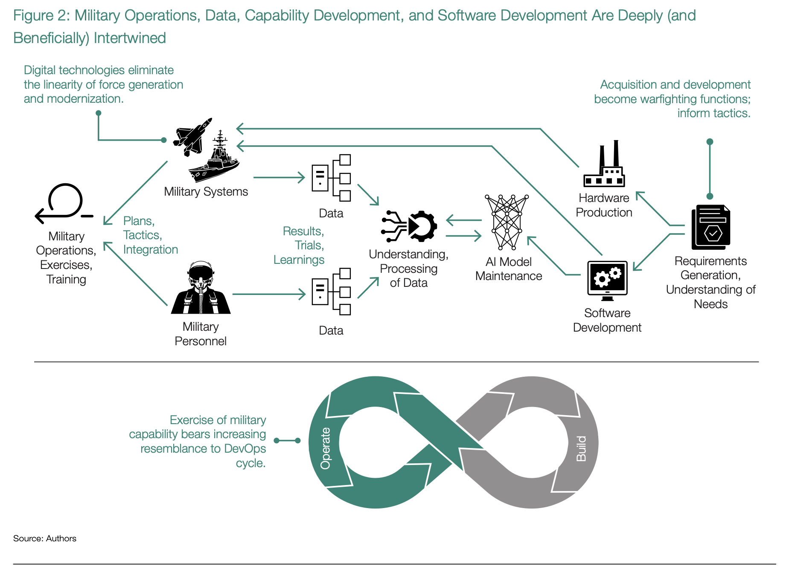

# Introduction

Embracing and orchestrating an ever-changing, diverse mixture of software is the key to competitive technical advantage 
in an era of ubiquitous computing and data

The software-defined world is no longer speculative; it is here. Software controls critical systems in our homes, from 
internet-connected smoke detectors to refrigerators and stoves. It controls core systems in our cars, helping us 
parallel park and even braking for us. It controls the critical infrastructure of cities, from traffic lights to 
drinking water. And in the case of the DoD, software controls everything from command-and-control systems to tactical 
sensors deployed at the edge, from business systems that issue paychecks to the voltage controller on a battery for a 
man-portable radio.

From the onset, readers should understand that the title Software Defines Tactics is a nod to what is conceptually a 
closed-loop system between military operations themselves (whether in peacetime or wartime) and the development and 
fielding of military capability. As more military systems are software-enabled and artificial intelligence becomes more 
proliferated, the coupling in this loop becomes tighter and the linkages become explicitly defined by digital data 
(see figure 2). The design, implementation, and deployment of software produce vast amounts of digital data whether 
the target environment is the cloud, a sensor at the tactical edge, or an embedded system in a warfighting platform.

That data is labeled, curated, and made accessible to data scientists looking to design and build next-generation AI or 
ML models. Scientists can extract the value of any of these AI/ML models only once they integrate a model back into a 
software system, completing the closed loop: software begets data, data begets AI/ML models, and AI/ML models need to 
be integrated back into software.

The Department of Defense, in its acquisition and development, needs to focus first and foremost on software, and only 
then consider the supporting hardware. The digital triad of software, data, and AI/ML models are so intertwined that to 
advance any one without advancing the other two is the equivalent of digital suicide. There is marginal value in 
expanding the scope and quality of digital data generated by a software solution if that data cannot be stored and 
retrieved for access by data scientists. By extension, there is little value in generating advanced AI/ML models if 
it is impossible to integrate those models into software that the US military can deploy in an operational environment 
at the speed of relevance. In fact, we hypothesize that the only leg of the digital triad that the DoD could advance 
in isolation is software, and this has been the de facto situation for several decades.

Focusing on the last two decades, the birth and corresponding hyper-growth of cloud service providers dramatically 
altered the way companies architect, build, test, and deploy software. Simultaneously, the growth of compute, network, 
and storage in these ecosystems reached a level of scale and affordability that spawned the current growth of data 
science to include narrowly focused AI/ML models. Our society now sees literally every commercial sector—from aerospace 
and defense to education, energy, finance, healthcare, and utilities—as software defined. The advent of cloud computing, 
cloud-native architectures, and what we now call the software factory has affected business strategies as much as it 
has affected warfighting strategies and tactics.

The DoD’s epiphany that whichever force exemplifies a mastery of cloud computing and software will have the upper hand 
in future conflicts materialized on September 17, 2017. On this date, the secretary of defense signed out a memo 
entitled “Accelerating Enterprise Cloud Adoption.” The memo recognized that commercial industry was outpacing the 
DoD, cloud infrastructure was enabling machine learning, and cybersecurity was becoming far more critical as a result. 
The memo concluded, “Speed and security are of the essence.”4

Following this epiphany, the FY18 National Defense Authorization Act (NDAA), section 872, directed the secretary of 
defense to task the Defense Innovation Board “to undertake a study on streamlining software development and acquisition 
regulations.” On May 3, 2019, the Defense Innovation Board published _Software Is Never Done: Refactoring the 
Acquisition Code for Competitive Advantage_ and a corresponding implementation plan.5 The report rationalized 
three fundamental themes:

1. Speed and cycle time are the most important metrics for managing software.
2. Software is made by people and for people, so digital talent matters.
3. Software is different from hardware (and not all software is the same).

It went on to outline four main lines of effort:

1. Congress and the DoD should refactor statutes, regulations, and processes for software.
2. The Office of the Secretary of Defense (OSD) and the services should create and maintain cross-program/cross-service digital infrastructure.
3. The services and OSD will need to create new paths for digital talent (especially internal talent).
4. The DoD and industry need to change the way they procure and develop software.

The DoD has made tremendous progress in some areas, like introducing DoD Instruction (DoDI) 5000.87, Software 
Acquisition Pathway. It has also been able to benefit from the Office of Personnel Management’s (OPM’s) recognition 
that the Computer Science Series of occupational requirements for government employees inadequately represented the 
growth of data as a specialty.6 OPM’s introduction of the Data Science Series allows the DoD to recruit from 
a pool of resources that it previously excluded because of the 1550 series requirement of studying differential and 
integral calculus. Calculus has not played as significant a role in the growth of AI/ML as statistics.

Yet in other critical areas, the DoD continues to struggle to find its footing. The department has yet to demonstrate 
it can consistently adopt and deploy cloud computing at a pace that matches commercial industry. On July 6, 2021, 
nearly four years after the Shanahan memo, the DoD terminated the $10 billion Joint Enterprise Defense Infrastructure 
(JEDI) cloud project.7 As of late 2022, the successor Joint Warfighting Cloud Capability (JWCC) program publicly 
stated that it has no plans to issue any awards until at least December 2022. Award is never a synonym in the DoD 
for operationally fielded, which means well over five years will have passed since the original memo declared that 
speed is of the essence.

Meanwhile in Topeka, Kansas, the co-founder of an agritech start-up entered her credit card data on Monday morning and 
by the afternoon was spun up, online, and running an entire business through the cloud, including sales, human 
resources, and finances functions. The company is using state-of-the-art software tooling to build a next-generation 
harvest optimization solution. This digital tooling exists for every innovator launching a new business venture, and 
it exists for peer and near-peer competitors that oppose democracy. This growing disparity should do more than merely 
cause concern among senior DoD leaders; it should trigger bolder actions.

An industrial agriculture company founded in the early 1900s, perhaps with a vision of making affordable tractors, 
would have had to think about freezing designs, blueprints, production capacity, spare parts inventory, and maintenance 
manuals before delivering its first product—rough analogs to factors in the milestones in the DoD acquisition process. 
However, the new agritech start-up can create operational capability in a day. Over the longer term, the start-up’s 
ability to meet customer needs, effectively sell and distribute its product, and stay relevant in a changing environment 
will determine whether it succeeds— these are unchanging principles. But information technology has greatly alleviated 
the burden of up-front planning and enabled the new start-up to evolve its way to success. External feedback helps 
catch and correct inevitable oversights, errors, and bad judgment; software tools lend insight on progress against the 
so-called -ilities, like maintainability.

The DoD is also struggling to recognize that data strategies that show great promise for enterprise systems do not 
translate well to the tactical edge, where denied, degraded, intermittent, or limited (DDIL) communications environments 
are the norm. The bandwidth available in Link 16—which the DoD designated as the primary tactical data link for all 
military service and defense agency command, control, and intelligence (C2I) systems in October 1994—has not 
substantially evolved since.8 Yet over this same period, internet traffic volume has grown exponentially.9 
The totality of data that computers generate on a naval vessel underway is measured in terabytes, and most of it must be 
thrown on the proverbial deck. Why? Due to a ship’s size, weight, and power (SWAP) constraints, adding racks of servers 
is not aviable option, and backhaul over Link 16 or other SATCOM channels is impractical.

Elsewhere, that same start-up in Topeka, Kansas, entered its credit card data and purchased state-of-the-art, 
low-latency broadband internet that works in remote and rural locations around the globe. Combining that service with 
a solar panel, this start-up has established more powerful backhaul for farm field environmental sensors than what the 
world’s most capable military has ready access to. To add insult to injury, the start-up spent less than the cost of 
two weeks of groceries for American households in the lowest income quintile.10 In the Ukrainian war, this same 
broadband has even demonstrated its ability to resist a peer military competitor’s electronic warfare attacks.11 
These facts lead the warfighter to an incredulous gasp and open ponderance of how an organization that Congress has 
authorized a top-line budget of $847 billion in the FY23 NDAA cannot figure out how to ubiquitously escape dial-up speeds 
at the tactical edge.

Lastly, and perhaps most critically, the DoD is struggling to realize gains from the Software Acquisition Pathway in 
a repeatable manner and at a scale that can outpace either near-peer or peer military competitors. A closer review of 
the pathway states:

> Programs will require government and contractor software teams to use modern iterative software development 
> methodologies (e.g., agile or lean), modern tools and techniques (e.g., development, security, and operations 
> [DevSecOps]), and human-centered design processes to iteratively deliver software to meet the users’ priority needs.12

Overwhelming evidence shows the world is deep into the turning point of the Age of Software.13 Too often, PEOs 
are found asking themselves what constitutes modern in an institution like the DoD that has demonstrated a proclivity for 
continually applying Industrial Age methods in the Age of Software. Some attempt to educate PEOs that water-Agile-fall 
is modern, when in reality they would do better to frame it as the “best some organizations can do to progress toward 
faster development.”14

We believe that the PEOs and their cadre of program managers are the critical unit of action for modernizing the 
department. And to deliver a warfighting advantage to their end-user, the DoD needs to equip these PEOs with knowledge 
and empower them to identify and look beyond the usual incumbents if water-Agile-fall is “the best” the organization 
can do. In the software-defined conflict, lives literally hang in the balance.

_Software Defines Tactics_ picks up where the _Software Is Never Done_ report ended, exploring three new critical 
concepts that the DoD needs to unpack to realize its ambition of dominating the Age of Software. It postulates that 
_Software Is Never Done_ contained enough material regarding digital talent that we have chosen to omit the subject 
from this piece. It also accepts, begrudgingly, that congressional action on statutes and regulations will occur 
across a period measured in years, if not decades. Instead of focusing on those aspects of the discussion, this 
piece explores several areas that _Software Is Never Done_ either implied or omitted.

First, we recognize and explore the _value of diversity of form_—the heterogeneity of software, if you will—and the fact 
that a one-size-fits-all approach, whether it is a software architecture or a data standard, is incongruent with the 
software-defined world the warfighter must fight in. Perhaps the most obvious example of this position is found in the 
enterprise system (e.g., travel reimbursement, payroll), which the DoD will never forward deploy and force to operate 
in an austere environment subject to denied, degraded, intermittent, or limited (DDIL) communications. Enterprise 
systems never have to make difficult design trade-offs because of SWAP constraints that exist on an aircraft, ship, 
or satellite. The worst self-imposed affliction on DoD enterprise systems is known as a period of non-disruption (POND), 
when a general or flag officer has determined that even applying software patches to avoid the chance of the system 
going offline is unacceptable. (The cybersecurity implications of a POND are worthy of separate and extended 
discussion.)

Second, the DoD needs to act in a way that recognizes _software_, not legacy warfighting platforms, _controls the 
speed and efficacy of the modern kill chain_ and military dilemma. The duality of software components, libraries, 
and frameworks is that they all apply to social media or gaming as much as to warfighting or intelligence, surveillance, 
and reconnaissance (ISR) systems. The acquisition engine should consciously acknowledge its own original sin, 
predilection for prediction, and accept and embrace the idea that warfighting systems have to adapt at the speed of 
software and not the speed of acquisition. This is not a hypothetical illustration. Public reporting on the low quality 
of F-35 software has been occurring for years to the extent that the DoD called in multiple universities to see if they 
might be able to help resolve the problems.15 In a world where software defines tactics, it is irrational, 
irresponsible, and perhaps even unethical to contractually require more than a broad set of outcomes because we simply 
cannot know actual architectural requirements a priori in a software-defined world.

Finally, the DoD needs to formally recognize the digital triad of software, data, and AI/ML as equal peers. The triad 
symbolizes the principled belief that _AI/ML model research cannot occur without troves of relevant digital data, and 
the only way to create digital data is through software_. Completing the feedback loop that validates AI/ML models in 
an operational environment is possible only if the DoD deploys the model—via software. Yet deployment frequencies 
measured in months, quarters, and years are undeniably not suitable for meeting the speed of relevance in a 
software-defined world.

Our collective conviction is that these principles drive our premise that the bedrock of success in the modern PEO is 
nothing less than identification and selection, empowerment, and operation of the software factory. The more effort PEOs 
put forth to recognize and embrace the digital triad as a closed-loop system that affects their kill chains, the more 
resilient and relevant capabilities they will field for the warfighter. Why? The side with the more capable software 
factory that can push out new fields for data collection faster, push out refined AI/ML models faster, and operate in 
austere environments with greater assurances of fielding cyber-resilient systems will enjoy both strategic and tactical 
advantages that too many military leaders under-appreciate today.

> Each member of the digital triad—software, data, and AI—is proverbially a mile deep and a mile wide. 
> Software is the primary focus of this work, and therefore we openly invite those with rich industry 
> expertise in data and AI/ML to build on our body of work in this report to support PEOs in the other two 
> members of the digital triad.

In the pages that follow, we will explore these three critical concepts intentionally from the perspective of the PEO: 
heterogeneity of software, how software controls the speed and efficacy of every possible modern kill chain, and, 
specifically, a coherent value proposition of the software factory.