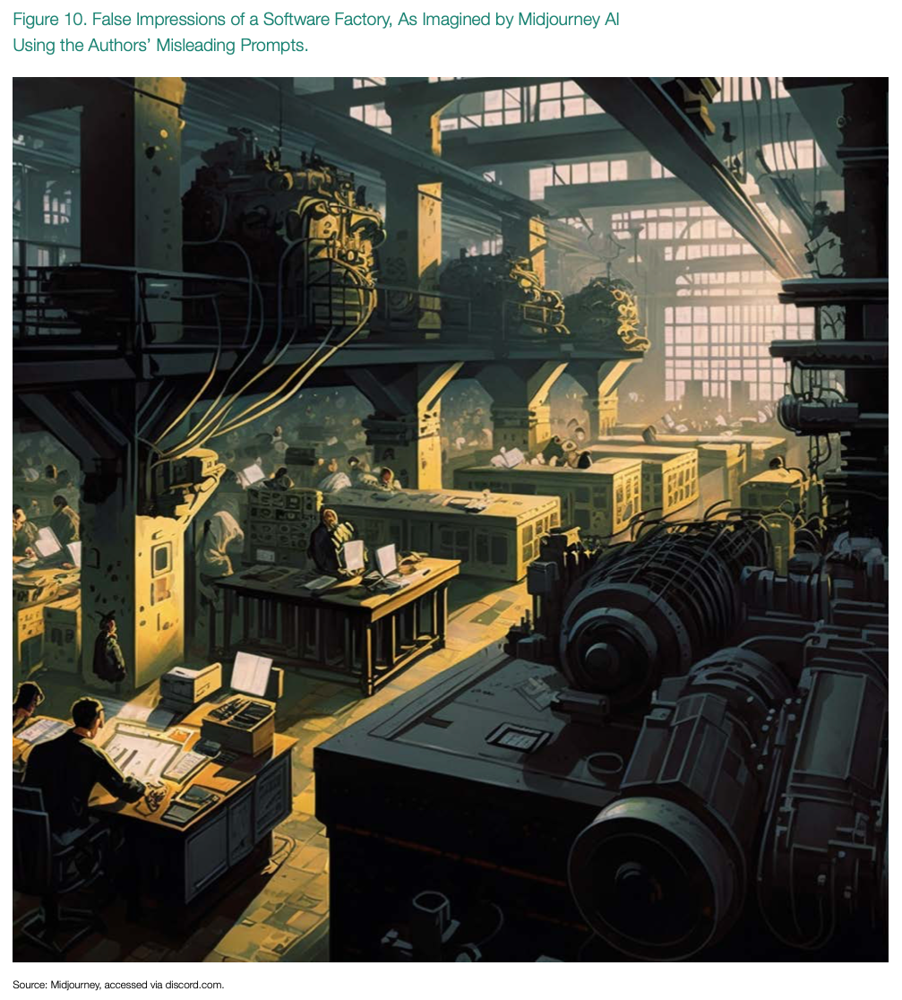
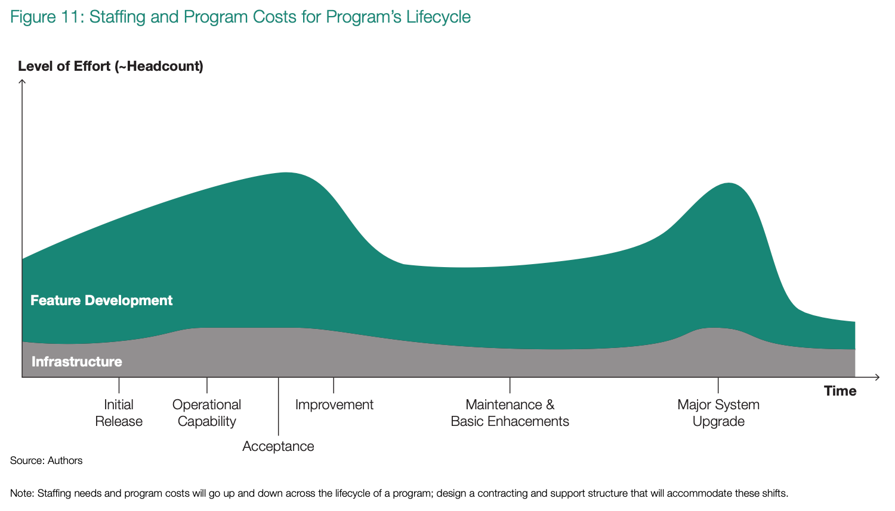

# The Modern Software Factory
> Digital foraging: Neither manufacturing nor software factories can be established overnight

The term software factory has an industrial-age ring to it. Perhaps it inspires visions of an iron boiler providing 
steam to power a hot, sweaty building where programmer-workers toil monotonously in round-the-clock shifts, producing 
near-identical chunks of software to meet the insatiable market demands. More pragmatically, one might imagine 
government-badged coders wearing hoodies and sitting in an open-plan office setting, banging away on keyboards to 
produce non-proprietary, government-owned software in order to prevent vendor lock from greedy contractors. This, 
however, would be a fundamentally mistaken vision of the software factory. Instead, a software factory is a process 
and supporting tool that provides software development teams with a repeatable, well-defined path to create and 
update production software and deliver it in a robust and resilient manner.

We intuitively recognize what happens when a production line closes down, whether it’s due to a temporary government 
shutdown43 or a decision to curtail production of an F-22 fighter.44

Rehiring the workers, rebuilding the tacit knowledge of assembly, or making the facility productive again is very 
difficult. A full shutdown of an aircraft assembly line is no different than a full shutdown of a DevSecOps factory. 
The libraries and frameworks they used become stale, unsupported, brittle, and vulnerable. Someone cannot just “turn 
it on” again and start spitting out software updates. Even while the source code for a program has not changed, the 
build tools and dependent libraries have done so continuously. Those changes have now created broken, incompatible 
application programming interfaces and other factors.

The digital world is relentless in its ceaseless change as updates and dependencies cascade around the globe and round 
the clock. So older software development paradigms—with the right compiler and source code—have had to adapt to new 
ways of designing, building, and managing software. Brian Kernighan—the K in the foundational K&R, the C programming 
language book that yielded the so-called “one true brace” style of programming—recently tried to contribute code to the 
text-parsing tool AWK that he created decades ago. AWK now represents a foundational element of Linux scripting, 
supporting cloud computing management among countless other projects. It is a foundational dependency, but it still has 
to be updated occasionally. Kernighan said, “Once I figure out how . . . I will try to submit a pull request. I wish I 
understood git better, but in spite of your help, I still don’t have a proper understanding, so this may take a 
while.”45 Even the true legends of the software community reach a point where their skills become stale when 
measured against modern development practices.

Ukraine’s use of Stinger and Javelin missiles perfectly illustrates that the challenge for digital components of 
military systems is far greater than simply turning the lights on and dusting off the equipment. Raytheon has openly 
stated that companies have stopped manufacturing key components, forcing the company to “redesign electronics in the 
missile’s seeker head.”46 The Iowa Army Ammunition Plant has been undergoing “wholesale renovation” for 
several years now, and the industry has lamented the fierce challenges of modernizing a plant while ramping up 
production to meet demand with inexperienced workers and securing the massive 19,011-acre facility against 
attack.47

Analogously, even if a PEO takes possession of all source code, build scripts, libraries, frameworks, etc., that act 
alone does not guarantee that the software’s CI/CD pipelines will whirl into operation several years later or that a 
workforce with up-to-date skills will be around. APIs change, and security patches stop being issued. For each legend 
like Kernighan who struggles with git, a foundational software development tool by modern standards, there are thousands 
if not tens of thousands of software developers who lack either exposure to or understanding of stale software 
environments that were hugely popular only 10 to 20 years ago (see CORBA and Enterprise Java Beans, for example).

Pause and reflect on this fact: The DoD is proudly home to software like Mechanization of Contract Administration 
Services (MOCAS), which developers were writing around the time the Soviet Union launched Sputnik in 1957 and which 
demonstrates the staying power of COBOL within the DoD. This is not just any software, either. It is mission-critical 
software that manages around $1.3 trillion in obligations spread across 340,000 contracts.48

## How the Ebb and Flow of Feature Development Affects Staffing
Like manufacturing factories, software factories require significant financial investment and the application of active 
management techniques to absorb the natural ebb and flow of major feature developmental periods as well as periods of 
patching and operational sustainment. This aspect of the software factory is so critical that leaders must chant it as 
a mantra regularly: if software is never done, then we can never mothball or defund its software factory for extended 
periods. In an era when software defines tactics, opining that it might be “a year or two” before a DevSecOps factory 
can be turned back on is irrational. PEOs should carefully study and consider how the traditional manufacturing 
workforce migrates from prime to prime as a program is re-bid over the years. They should also recognize that they will 
likely need to support this behavior with DevSecOps factories, too.

> The program needs some people all of the time (e.g., System Reliability Engineers, or SREs) but does not need all 
> people all of the time (e.g., software architects, data scientists, AI researchers, etc.)

The uneven distribution of work is especially apparent in software because the program needs some people all of the 
time but does not need all people all of the time. The simple recognition of this fact leads to an intriguing debate 
about the actual role of the DoD in software development. There is widespread recognition that industry is adept at 
corralling the requisite cutting-edge talent to contribute the big, shiny, new capabilities and features, the corollary 
of which is that the modern DoD is not known for introducing cutting-edge software innovations to the commercial world. 
There is also a consensus that the DoD’s military and civilian leaders evaluate and define its risk and cyber-defense 
posture. For example, the DoD may turn the dial based on world events and declare a POND. This same group of 
professionals is largely capable of operating the day-to-day routine patching and sustainment of an application 
ecosystem, specifically the necessary work that cutting-edge talent tends to avoid because it does not allow them to 
exercise critical thinking and design skills above the waterline separating innovation from routine (see figure 11).

Recognition of the high variability of work within a software factory is a concept so critical that we capture it as 
Factor 1 in what we call the Two Factors Principle. Factor 2 is the implementation model of the software factory itself. 
In the early days of Kessel Run, the Air Force’s leading software factory, the government was its predominant owner and 
operator. This arrangement contrasted with many programs in which the software ecosystem is primarily contractor-owned 
and contractor-operated (COCO) model. The characteristics of the COCO model can be detrimental to the government’s needs 
and taxpayer interests due to six “empirically demonstrated” vulnerabilities in government-funded COCOs.49 
Each of the six vulnerabilities relates to the modern software factory, but one in particular stands out as a 
significant concern: a contractor’s ability to unilaterally decide to leave the market. Using MOCAS as an example, a 
COCO software factory asset focused on COBOL development in 2022 would draw significant shareholder scorn and risk 
simply being shut down for the sake of profitability.

Our premise in this report is that the DoD has to operate as integrator for all critical combat software capabilities to 
mitigate the six vulnerabilities of relying on contractor-delivered binary software or even on COCO software factories. 
Behind closed doors, the defense industry voices concerns about this model. They usually frame their argument in self-
serving terms, and some see it as a threat to both their operational profit models and their ability to generate value 
from their own intellectual property and capital assets. On the other hand, the DoD has well established its angst over 
sharing software designs only to have them come back stamped as proprietary information.50 Implementation 
model selection is a critical aspect that PEOs cannot afford to marginalize. A PEO who opts for a pure government model 
risks alienating a statistically significant portion of the defense industrial base (DIB). A PEO who opts for the COCO 
model could be “giving away taxpayer money to a private corporation to build a capital asset that the government does 
not own or control necessarily.”51

There is a third model that has not been aggressively explored in the era of intangible data and software: the 
government-owned, contractor-operated (GOCO) model. GOCO facilities are not some radical idea and in fact can trace 
their roots all the way back to the Manhattan Project. The GOCO model may provide the win-win scenario for both the DoD 
and the DIB. Consider that beyond the Iowa plant cited earlier; the government also owns plants in Scranton, Radford, 
Kansas, and elsewhere—all of which contractors operate. This model extends beyond the DoD to the Department of Energy 
(DoE). The DoE owns the Nevada Test Site, Los Alamos National Lab, and several other major national security assets, 
but has contractor assistance in operating them under the GOCO model.

The DoD should own its software factories, and the DIB should not irrationally fear this construct. Industry can and 
should play a vital role in contributing innovations during periods of feature flow; they can bring their cutting-edge 
software to the factory, and even retain their intellectual property. Adoption of a GOCO model also mitigates the risk 
of losing access to a software factory ecosystem when DIB executives grapple with their fiduciary obligations to cut 
costs, raise profits, and issue dividends to institutional shareholders. In short, a commercial entity cannot decide 
to sell a government-owned asset. This barrier allows the DoD and its PEOs to ensure that the software factory remains 
in operation during both periods of feature flow and periods of sustainment, readily available to support the warfighter 
in their mission.

The Two Factors Principle is a nod that each factor cannot be described independently of the other. The DoD’s modern 
software factories should not and cannot be exposed to capitalist behaviors because the DoD is not a capitalist 
organization—it is a monopoly with statutory authorities to conduct war when authorized by civilian leadership. Active 
kinetic warfare is not a perpetual activity, and neither is active software feature development. All software, from 
mobile apps to operating systems, cyclically operates across periods of feature development and sustainment, and the 
realization of a series of GOCO software factories would accelerate software development best practices and perhaps 
even the DoD’s digital modernization aspirations.

The outcome that the Two Factors Principle embodies is that DevSecOps factory model selection has to offer assurance 
that the software factory can never be fully shut down at any point during the life of the program and that the staffing 
ratio of the program will naturally ebb and flow in response to periods of feature innovation and periods of routine 
sustainment.

## Breaking the Caste System and Acknowledging That Development is Production
Too many visionary leaders have fallen into the trap of perpetuating the belief that development environments are 
inferior to production environments. Senior executives do not get notifications when a development environment suffers 
an outage, but they get calls in the middle of the night when a production outage occurs. The DoD treats development 
environments as so called permissive environments for doing all types of so-called risky work, like using a software 
compiler or testing websites using a nonstandard port like 8888. Accepting a fragile, brittle, or unreliable development 
environment represents a category of risk on par with that of production environments. A software factory that cannot 
instantly respond with a push to production in the minutes after the enemy exploits a zero-day cyber threat during 
wartime is the digital equivalent of a forward-deployed aircraft carrier with an unreliable catapult system. We do not 
separate the catapult from the carrier, and we should not separate software development from production.

Despite the highly publicized impact of software supply chain attacks and the need to invest more in development of 
ecosystems, all areas of the DoD still lag in advancing the posture and status of the venerable software development 
environment. In fact, over a decade has passed since the DoD substantially updated rules that prohibit entire categories 
of software from connecting to production networks like NIPRNet.52, The unwillingness and inability to allow 
a tool like git onto secure networks is absurd—it is not a compiler and cannot be used in isolation to field new 
unauthorized executable applications onto a network like the NIPRNet, because it is a development tool. It firmly 
demonstrates either a complete lack of understanding of modern digital logistics or a profound stubbornness to admit 
that the policies of the past conflict with the logistical need to fight and win tomorrow’s conflict.

As far as tooling goes, git is the bedrock of all modern software development environments. Service Organization 
Controls (SOC) audits require significant evidence that the organization controls who has access to source code or can 
perform a deployment into production, that the code cannot be blindly merged into a main branch without a review by 
multiple eyes, and that older versions are easy to access. Acceptance of the reality that software defines tactics is a 
transitive acceptance of the idea that development is production and that git is the critical component. Stated in more 
unequivocal terms, git is the Microsoft Word of the modern software-defined world. It should not be a tool that only 
software engineers can use, either, in an era when the speed of the observe–orient–decide–act (OODA) loop matters more 
than ever. Let’s explore this concept further to understand how the tooling of the modern software factory can help 
organizations operate at a higher velocity.

## Documentation as Code
Using git, it is possible to easily illustrate how modern software factory tooling could change the way the DoD goes 
about consensus building across its vast organization. To craft this illustration, we first have to introduce 
Washington Headquarters Service (WHS), the entity that is the custodian of the Correspondence and Task Management 
System (CATMS).

The WHS describes the CATMS as “a flexible and scalable system that allows component users to create, delegate, assign, 
respond, and research a knowledge repository linked with task and correspondence accurately and 
efficiently.”53 In simpler language, the CATMS “coordinates” memos or documents across the military 
departments in a very specific manner. Coordination starts by circulating the memo to the affected GS15/O-6 crowd, who 
must adjudicate all comments and feedback by a given suspense date that is typically either 14 or 30 days out.

Rarely do all entities redline the document and respond by the suspense date, so extensions are common.

There are substantive and critical comments, the latter of which are strenuous objections. Per the CATMS FAQs, “All 
comments submitted in coordination must be adjudicated,” and that occurs with a DD Form 818, the Consolidated DoD 
Issuance Comment Matrix—an Excel spreadsheet.54 For example, suppose the author chose the word resilient 
and a component feels that uncompromising is a more compelling word. The system captures the rationale to accept or 
reject the feedback. Critical non-concurs usually require formal meetings and a lot of compromise to resolve—politics 
enter here. Too many substantive comments can also justify a non-concur.

After the relevant departments complete this round of edits, the memo is republished for general officer / flag officer 
(GOFO) review. These one and two-star military and civilian equivalents now have their opportunity to redline the 
document. The parties issue a suspense date, grant extensions, and adjudicate comments.

Next up is principal staff coordination, involving the under and assistant secretary levels of the bureaucracy. Again, 
the parties give the document a suspense date, extension, and adjudication as necessary. Finally, they prepare a 
signature package for the deputy secretary of defense. They long ago socialized the intent of the memo, and now they 
review and may ask why previous reviewers did not consult Component X or selected a particular word or phrase—and they 
may ask for more coordination. Once they sign, everyone already knows what they have signed because it represents the 
consensus of the organization and it was fully coordinated.

Now, let us reimagine this process using git. Instead of relying on a word processor and spreadsheet that perpetuate 
duplicative data entry problems during adjudication, the process pivots to adopt markdown. Markdown is easy to learn 
and ubiquitous across the internet, and an abundance of tooling exists to accept it as input and apply style sheets 
to render it in visually compelling ways.

In the git repository, developers create a new project representing the memo, create a branch called first_draft, and 
then draft the memo. They issue a merge request and invite in all of the reviews, requiring everyone to openly share 
feedback with everyone else. This eliminates the unintentional secrecy that too often occurs during coordination because 
components cannot instantly and immediately see feedback from others in real time. Components that have a substantially 
different vision can branch off first_draft, make their edits, and issue their own merge request. Anyone can advance 
future iterations of the policy or memo merely by creating a branch, making the changes, and issuing a merge request. 
Modern git tooling supports what is known as signed commits, adopting digital signatures to ensure non-repudiation—
confirming the author really is who they say they are, in essence. The collaboration is transparent and instant, and 
there is no need to reenter modified sentences or formally find times for meetings because the git history contains 
everything.

It is unrealistic to believe that WHS will abandon CATMS anytime soon, but PEOs should explore this technique of 
documentation as code because it inculcates the software factory’s importance throughout the program and for the life of 
the program. Envision a scenario in which it becomes impossible to drive the necessary paperwork of the program without 
a functioning software factory. Documentation as code is one of many illustrative techniques that could help a PEO focus 
on an outcome in which the lifelines of the program and software factory become indistinguishable.

## Seeking Good and Amplifying It
As an institution, the DoD is not known for its marketing prowess. Highly valuable communities of practice, like the 
DevSecOps Community of Practice that meets virtually every month, represent some of the best forms of grassroots 
collaboration across the military departments and the DoD’s fourth estate. Unlike commercial enterprises, the DoD 
allocates no marketing budget to raise awareness of these valuable events. By and large, word of mouth is as good as it 
gets, and for an organization the size of the DoD, voices only carry so far. Discerning what works and, perhaps more 
importantly, sharing and learning from what did not work are too often ad hoc activities. The modern software factory is 
not a static rendezvous point identified by precise Global Positioning System coordinates. Identifying what good looks 
like remains an open problem for the DoD.

The DOD CIO Library,55 offers a wealth of consensus-driven reference designs that capture what good looks 
like. The DevSecOps Guides and Playbooks offer strategic-level insights, while multiple approved reference designs 
provide tactical implementation guidance. The existence of multiple consensus-driven, peer-reviewed reference designs 
is a sign that leadership is beginning to recognize and explore the value of diversity of form, the heterogeneity of 
software.

## More Work Remains
Embedded systems and hardware-in-the-loop (HIL) capabilities lag behind their cloud-centric reference designs. The 
Cloud Native Access Point (CNAP)56 is one of the DoD’s best-kept secrets born from the Air Force’s early 
leadership in embracing modern software development. Both government and industry should analyze this reference design 
through the lens of software heterogeneity. It is vendor agnostic and demonstrates a level of elasticity and 
adaptability that should make it a default choice for every new program the DoD launches.

Undoubtedly the Pentagon will remain a consensus-driven organization. Suggestions that the organization somehow behave 
like an autocratic software start-up will not come to fruition and are arguably counterproductive. However, PEOs cannot 
and should not invoke consensus as an excuse for lethargy in a world where software moves at a frenetic pace. Every 
program will have the proverbial aha! moment in realizing its own modern software factory. Every program is equally at 
risk of wasting time, money, and energy reinventing the wheel. Modern software factories have to avoid falling under the 
immense weight of a snowflake: “Our program is different, so we will start from scratch.” No more disastrous view exists 
in a world where open-source software and application programming interfaces drive progress. There is no defensible 
reason for not recognizing what good looks like and then extending beyond it to capture the unique needs of a program.

This is where DODI 5000.87, the Software Acquisition Pathway, should rise to confront the challenges of establishing 
modern software factories. The DoD should incentivize PEOs to attain membership in the 5000.87 club. DODI 5000.87 offers 
a stable platform for institutionalizing the Two Factors Principle, requiring PEOs to seek out a model and invest in the 
roughly three dozen software factories that exist across the DoD. It can force PEOs to pause and reflect on their 
program’s distinct strategy for the natural ebb and flow of feature work and sustainment. DODI 5000.87 is unequivocally 
the foundation for applied software acquisition in a world where software defines tactics.